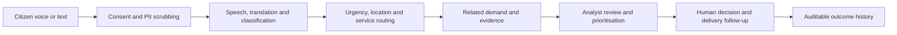

# Nexus VisBharat (NVB)

## Multilingual civic intelligence for better public services

Nexus VisBharat connects citizen voice with the public-service teams responsible for understanding, prioritising and following through on local needs. A person can submit a report in text or speech; NVB protects the input, structures the context, routes the case and preserves the human decision trail.

This repository is the Code for Communities submission for [Build with AI: Code for Communities, second edition](https://hack2skill.com/event/codeforcommunities2?utm_source=hack2skill&utm_medium=homepage&sectionid=6a7aeec965fbd7acf70c1764).

## Live service and interactive showcase

- **Primary Live Cloud Run Deployment:** [nexus-visbharath-510474645723.asia-south1.run.app](https://nexus-visbharath-510474645723.asia-south1.run.app/)
- **Interactive Visual Showcase App:** [nexusaitech.in/apps/nvb/index.html](https://nexusaitech.in/apps/nvb/index.html)
- **Source code:** [github.com/sonofmoon/nexus-visbharat](https://github.com/sonofmoon/nexus-visbharat)

The live deployment is a working demonstration environment. The showcase corpus is synthetic, and the evidence notes below describe what has been measured, what is provisional and what still requires a real municipal pilot.

## The idea in one minute

Public-service information often arrives as short messages, voice notes and local-language descriptions. The signal is valuable, but it is difficult to compare across channels, languages, locations and departments.

NVB creates a shared operating picture:



The system keeps model-assisted interpretation separate from policy decisions. Immediate hazards use a deterministic FastPath, while capital and programme decisions remain subject to human review.

## See the product in action

The screenshots below are part of the repository and show the main product journey. They use the prepared showcase environment; they do not represent authenticated citizen records or proof of government adoption.

### 1. Start with a citizen signal

A multilingual intake experience gives people a practical way to describe a local problem through text or voice.


*The public-facing entry point introduces the workflow and makes the live service easy to reach.*

### 2. Capture voice with language context

The intake flow supports speech and text, keeps the original language visible and gives the person an opportunity to review the interpreted content before submission.


*Voice intake is designed around transcript review and human confirmation.*

### 3. Move from individual reports to patterns

The policy dashboard helps teams compare demand, service categories, geography and inclusion signals before considering a response.


*The dashboard is a decision-support view; it does not make an automatic budget award.*

### 4. Rehearse a scoped pilot

The pilot workspace shows how a programme can rehearse local routing and state or district boundaries before a wider rollout.


*Pilot scenarios remain labelled as rehearsal data until an authority supplies approved operational data.*

### 5. Preserve the evidence trail

The auditor workspace links cases, evidence and recorded actions so that an authorised team can inspect what happened and why.


*The audit chain is tamper-evident and explicitly verifiable; it is not presented as an immutable ledger.*

## Product capabilities

| Capability | What NVB provides |
|---|---|
| Citizen intake | Text, browser voice and assisted channel workflows with consent and source context. |
| Language intelligence | Speech transcription, translation and structured extraction for English, Tamil and Telugu paths. |
| Emergency FastPath | Deterministic hazard screening and escalation when provider calls are unavailable or a high-severity signal needs immediate handling. |
| Analyst workspace | Demand, inclusion, gap, project and budget scenario views for human-led planning. |
| Delivery follow-up | Tasks, decisions, evidence and completed-window outcome reporting in one timeline. |
| Audit and governance | Role-scoped access, minimized provider telemetry, PII scrubbing, idempotent intake and hash-linked audit events. |

## Google Cloud implementation

NVB uses Google Cloud services where they provide useful operational capability:

- **Cloud Run** hosts the web application and service endpoints.
- **Gemini / Vertex AI** supports structured classification, translation and synthesis where configured.
- **Cloud Speech-to-Text** supports voice intake.
- **Cloud Translation** supports multilingual workflows.
- **Cloud SQL PostgreSQL** is the durable deployment path for operational records.
- **Pub/Sub and an outbox pattern** support controlled agency delivery and replay-safe processing.
- **BigQuery and reference-data adapters** support analytics and contextual indicators where configured.

The application includes a deterministic local path for emergency screening and offline development. A configured provider is not treated as proof of a successful live inference; provider evidence is recorded separately when available.

## Trust model and operating boundaries

NVB is designed to make the important boundaries visible:

- Personal identifiers are scrubbed at ingress before storage or model processing where the configured scrubber applies.
- Model output is kept separate from policy scoring and human authorisation.
- Role-scoped access limits analyst, auditor and administrator operations.
- Audit events are hash-linked and can be explicitly verified.
- Synthetic, descriptive and externally verified evidence are labelled separately.
- A source checksum establishes file integrity; it does not establish publisher authenticity.
- Consent and access controls are engineering implementations of DPDP Act 2023 principles, not formal legal certification.

## Evidence and current limits

- [Multilingual evaluation](docs/evaluation/quality.json) contains 108 developer-curated challenge cases across English, Tamil and Telugu. It reports category macro-F1 of 0.9746, urgency accuracy of 86.11% and emergency recall of 33/33 (11 EN, 11 TA, 11 TE). Independent external adjudication remains pending.
- [Baseline comparison](docs/evaluation/baseline-quality.json) records the local keyword fallback on the same challenge set.
- [DPDP architecture](docs/DPDP_COMPLIANCE_ARCHITECTURE.md) documents consent, data-minimisation, Laplace Differential Privacy (ε = 1.0) and ingress-scrubbing design choices.
- [Security threat model](docs/SECURITY_THREAT_MODEL.md) describes trust boundaries, token handling, Secret Manager rotation and RBAC controls under the STRIDE framework.
- [External audit anchoring](docs/EXTERNAL_ANCHORING_SPEC.md) specifies Merkle root batching, RFC 3161 trusted timestamps and Sigstore Rekor public transparency log integration.
- [Model evidence dossier](docs/evaluation/MODEL_EVIDENCE_DOSSIER.md) records proxy diagnostics, calibration telemetry and forecasting limitations.
- [Reproducible ML pipeline](scripts/train_stress_model.py) implements reproducible training and verification for the Layer 4 spatial demand stress booster (`model.bst`).
- [Load measurements](docs/evaluation/load.json) cover synthetic rows and local Flask test-client conditions; they exclude network and provider latency.
- [Pilot deployment runbook](docs/MINISTRY_PILOT_DEPLOYMENT_RUNBOOK.md) describes the Cloud SQL, recovery and identity configuration required for an operational pilot.

These artifacts establish implementation evidence and documented limits. They do not establish population-level accuracy, ministry adoption, causal public-service impact or formal certification.

## Explore the live workflows

- [Citizen voice intake](https://nexus-visbharath-510474645723.asia-south1.run.app/submit)
- [Ticket journey and submission trace](https://nexus-visbharath-510474645723.asia-south1.run.app/submission)
- [Policy Dashboard](https://nexus-visbharath-510474645723.asia-south1.run.app/dashboard)
- [Pilot Portal](https://nexus-visbharath-510474645723.asia-south1.run.app/pilot)
- [Auditor workspace](https://nexus-visbharath-510474645723.asia-south1.run.app/auditor)
- [AI operation status](https://nexus-visbharath-510474645723.asia-south1.run.app/api/ai/status)
- [Readiness endpoint](https://nexus-visbharath-510474645723.asia-south1.run.app/readyz)

## Run locally

Use Python 3.11. Dependencies are defined in `requirements.txt` and resolved in `requirements.lock`.

```sh
python -m venv .venv
# Activate .venv for your shell
pip install -r requirements.txt
python -m flask --app app run --host 127.0.0.1 --port 5000 --no-reload
```

For an isolated offline demonstration:

```sh
NVB_DISABLE_EXTERNAL_SERVICES=1
DEMO_MODE=true
```

Set the variables in your shell or local environment before starting the application. Do not commit `.env` files, credentials or service-account keys.

## Persistence and deployment

SQLite is intended for local development and disposable demonstrations. Cloud Run serving instances require external PostgreSQL for durable operational records. The pilot Terraform and [deployment runbook](docs/MINISTRY_PILOT_DEPLOYMENT_RUNBOOK.md) describe the Cloud SQL, Secret Manager, recovery and identity path. Review the plan, back up existing state and complete restart and two-instance acceptance before promoting traffic.

## Verification

```sh
python -m unittest tests.test_submission_readiness tests.test_ministry_pilot tests.test_analyst_workbench tests.test_auditor_workbench
```

These tests use isolated data and disable external providers. Report local contract results separately from live provider demonstrations.

## License and attribution

Released under the [Apache License 2.0](LICENSE).

Developed by **Dr. Ravikumar Chandrasekaran**, Thanthai Periyar E.V. Ramasamy Government Polytechnic College, Vellore, Tamil Nadu.


