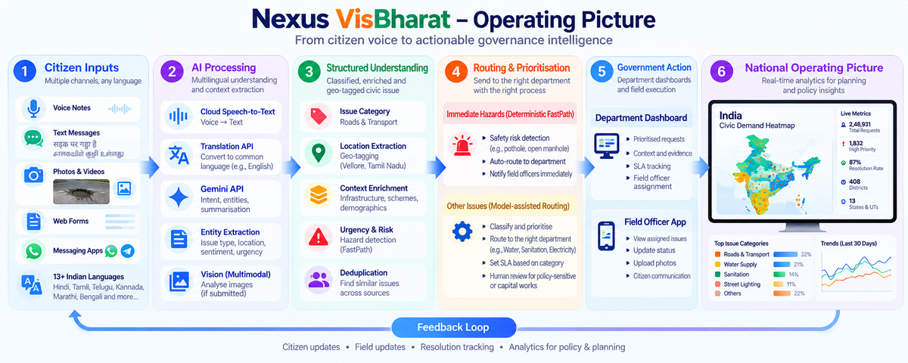
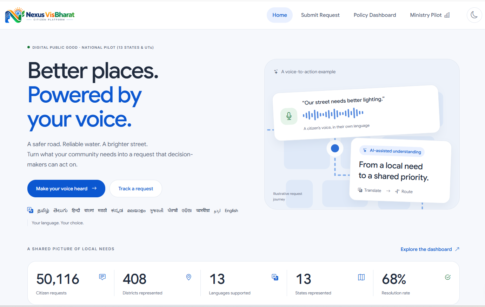
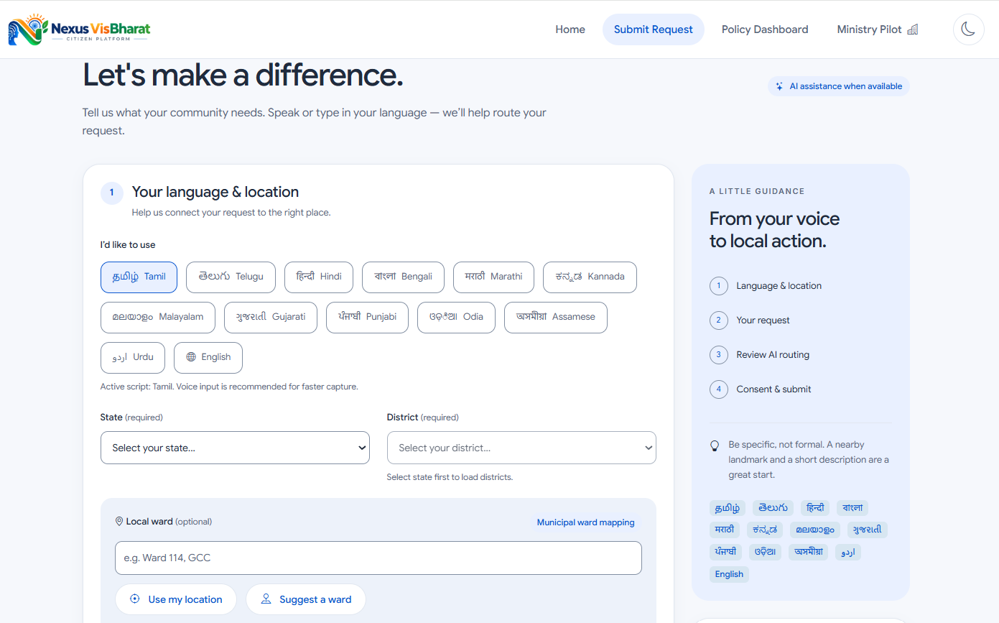
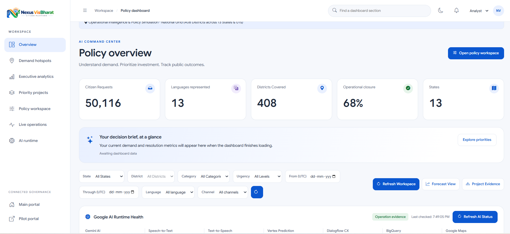
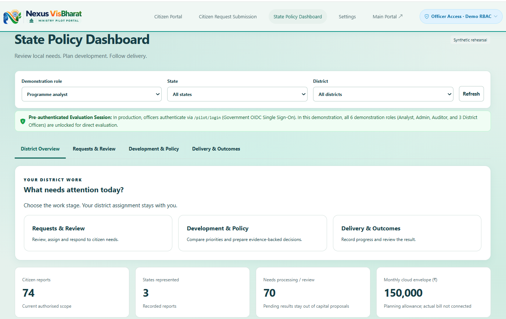
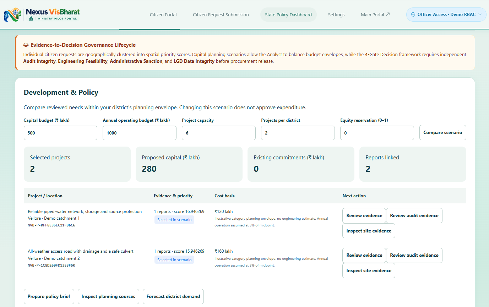

<p align="center">
  <a href="https://hack2skill.com/event/codeforcommunities2?utm_source=hack2skill&utm_medium=homepage&sectionid=6a7aeec965fbd7acf70c1764">
    
  </a>
</p>

<p align="center">
  <a href="https://nexus-visbharath-510474645723.asia-south1.run.app/">
    
  </a>
</p>

# Nexus VisBharat (NVB)

## Multilingual civic intelligence for better public services

Nexus VisBharat connects citizen voice with the public-service teams responsible for understanding, prioritising and following through on local needs. A person can submit a report in text or speech; NVB protects the input, structures the context, routes the case and preserves the human decision trail.

This repository is the Code for Communities submission for [Build with AI: Code for Communities, second edition ↗](https://hack2skill.com/event/codeforcommunities2?utm_source=hack2skill&utm_medium=homepage&sectionid=6a7aeec965fbd7acf70c1764).

> 💡 **Reviewer Tip:** Hold `Ctrl` (or `Cmd` on macOS) when clicking live demo links to open them in a new browser tab alongside this documentation.

## Live service and interactive showcase

- **Primary Live Cloud Run Deployment:** [nexus-visbharath-510474645723.asia-south1.run.app ↗](https://nexus-visbharath-510474645723.asia-south1.run.app/)
- **Interactive Visual Showcase App:** [nexusaitech.in/apps/nvb/index.html ↗](https://nexusaitech.in/apps/nvb/index.html)
- **Official Telegram Citizen Bot:** [@NexusVisBharatBot ↗](https://t.me/NexusVisBharatBot) *(Live omnichannel citizen filing & tracking with Tamil-first multilingual support)*
- **Source code:** [github.com/sonofmoon/nexus-visbharat ↗](https://github.com/sonofmoon/nexus-visbharat)
- **Official Project Pitch Deck (PDF):** [Nexus_VisBharat_Pitch_Deck.pdf ↗](docs/pitch/Nexus_VisBharat_Pitch_Deck.pdf)
- **Official Video Walkthrough:** [YouTube (3:16 Demo) ↗](https://youtu.be/zIRLMG5ZPjU)

The live deployment is a working demonstration environment. The showcase corpus is synthetic, and the evidence notes below describe what has been measured, what is provisional and what still requires a real municipal pilot.

## The idea in one minute

Public-service information often arrives as short messages, voice notes and local-language descriptions. The signal is valuable, but it is difficult to compare across channels, languages, locations and departments.

NVB creates a shared operating picture:



The system keeps model-assisted interpretation separate from policy decisions. Immediate hazards use a deterministic FastPath, while capital and programme decisions remain subject to human review.

## Designed as a Digital Public Good

Nexus VisBharat is designed to support reusable, accountable civic infrastructure through open source software, documented interfaces and configurable safeguards.

- **Open licensing:** Released under the [Apache License 2.0](LICENSE), permitting use, inspection, modification and redistribution subject to its terms. External datasets and provider services retain their respective terms.
- **Multilingual participation:** The broader prototype includes support for 13 languages. The bounded pilot enables Tamil, Telugu, Kannada, Hindi and English; voice execution and language quality require service-specific verification.
- **Reusable configuration:** Containerised deployment, configurable district and department routing, and multiple intake connectors support adaptation across communities. Connector implementation and verified external delivery are reported separately.
- **Documented interfaces:** REST API documentation and JSON schemas describe analyst decisions, federation records and auditor evidence exports.
- **Privacy safeguards:** Consent records, pattern-based identifier masking in selected intake paths, role-scoped access and redacted evidence exports support responsible data handling. Public aggregates can optionally use differential privacy, with a default epsilon of 0.75 when enabled. These controls do not constitute legal compliance certification.

NVB is designed with Digital Public Good principles in mind. It does not claim formal recognition or endorsement by the Digital Public Goods Alliance.

## See the product in action

The screenshots below are part of the repository and show the main product journey. They use the prepared showcase environment; they do not represent authenticated citizen records or proof of government adoption.

### 1. Start with a citizen signal

A multilingual intake experience gives people a practical way to describe a local problem through text or voice.



*The public-facing entry point introduces the workflow and makes the live service easy to reach.*

### 2. Capture voice with language context

The intake flow supports speech and text, keeps the original language visible and gives the person an opportunity to review the interpreted content before submission.



*Voice intake is designed around transcript review and human confirmation.*

### 3. Move from individual reports to patterns

The policy dashboard helps teams compare demand, service categories, geography and inclusion signals before considering a response.



*The dashboard is a decision-support view; it does not make an automatic budget award.*

### 4. Rehearse a scoped pilot

The pilot workspace shows how a programme can rehearse local routing and state or district boundaries before a wider rollout.

The bounded pilot rehearsal covers **Vellore, Tirupati and Bengaluru Urban**, with these [prepared fictional examples](visbharat/services/pilot_examples.py):

| District | State | Prepared example |
|---|---|---|
| Vellore | Tamil Nadu | Tamil — Water Supply: drinking water available for only one hour daily and a leaking pipe near a school. |
| Tirupati | Andhra Pradesh | Telugu — Sanitation: a blocked street drain causes rainwater to collect near a school. |
| Bengaluru Urban | Karnataka | Kannada — Road: large potholes near a bus stop affect children travelling to school. |

These are synthetic rehearsal scenarios, not claims of participating government authorities or live citizen requests. The five pilot languages are Tamil, Telugu, Kannada, Hindi and English.



*Pilot scenarios remain labelled as rehearsal data until an authority supplies approved operational data.*

### 5. Preserve the evidence trail

The auditor workspace links cases, evidence and recorded actions so that an authorised team can inspect what happened and why.



*The audit chain is tamper-evident and explicitly verifiable; it is not presented as an immutable ledger.*

## Product capabilities

| Capability | What NVB provides |
|---|---|
| Citizen intake | Text, browser voice, "Talk to NVB" conversational assistant (Dialogflow CX & Speech-to-Text with multi-line voice dictation review), and official Telegram Bot (`@NexusVisBharatBot`) with consent and source context. |
| Language intelligence | The broader prototype includes configuration for 13 supported languages (Tamil first, Telugu, Kannada, Hindi, English, etc.). Availability and evaluated quality vary by language, feature and provider. |
| Emergency FastPath | Deterministic hazard screening and escalation routing; external delivery and responder acknowledgement require configured connectors and receipt evidence. |
| Analyst workspace | Demand, inclusion, gap, project and budget scenario views for human-led planning. |
| Delivery follow-up | Tasks, decisions, evidence and completed-window outcome reporting in one timeline. |
| Audit and governance | Role-scoped access, minimized provider telemetry, PII scrubbing, idempotent intake and hash-linked audit events. |

## Google Cloud implementation

NVB uses Google Cloud services where they provide useful operational capability:

- **Cloud Run** hosts the web application and service endpoints.
- **Gemini / Vertex AI** supports structured classification, translation and synthesis where configured.
- **Cloud Speech-to-Text** supports voice intake.
- **Cloud Translation** supports multilingual workflows.
- **Cloud SQL PostgreSQL** is the durable deployment path for operational records.
- **Pub/Sub and an outbox pattern** support queued delivery to configured destinations; agency receipt must be verified separately.
- **BigQuery and reference-data adapters** support analytics and contextual indicators where configured.

The application includes a deterministic local path for emergency screening and offline development. A configured provider is not treated as proof of a successful live inference; provider evidence is recorded separately when available.

## Trust model and operating boundaries

NVB is designed to make the important boundaries visible:

- Selected intake paths apply pattern-based masking of recognised identifiers. Private records may retain original content; complete anonymisation is not guaranteed.
- AI-assisted classifications feed explicit planning rules; scoring assumptions are inspectable and funding decisions require human approval.
- Role-scoped access limits analyst, auditor and administrator operations.
- Audit events are hash-linked and can be explicitly verified.
- Synthetic, descriptive and externally verified evidence are labelled separately.
- A source checksum establishes file integrity; it does not establish publisher authenticity.
- Consent and access controls are engineering implementations of DPDP Act 2023 principles, not formal legal certification.

## Public release and live-feed contract

The Public Suite is a publication-safe view of NVB. It is intentionally
different from the authenticated Analyst, Auditor and Admin workspaces.

### Public data boundary

- The public complaint feed publishes category-level summaries only.
- Citizen-submitted text, contact details, PII and exact locations are withheld.
- Ward values are not fabricated when they are unavailable.
- Repeated records and automated confirmation messages are suppressed or marked.
- Small geographic and category groups are suppressed using
  `PUBLIC_TRANSPARENCY_MIN_GROUP_SIZE`, which defaults to `3`.
- Differential privacy can be enabled for public aggregates with
  `PUBLIC_TRANSPARENCY_DP_ENABLED=true`.
- When enabled, the default public-transparency epsilon is `0.75`, configurable
  through `PUBLIC_TRANSPARENCY_DP_EPSILON`.

### Public endpoints

| Endpoint | Purpose |
|---|---|
| `/api/complaints` | Filtered, redacted public complaint feed |
| `/api/v1/live-feed/stream` | Server-sent live-feed updates with reconnect cursors |
| `/api/public/transparency/summary` | Privacy-thresholded public metrics |
| `/api/public/transparency/priority-signals` | Screening-only priority signals |
| `/api/public/transparency/districts` | Thresholded district aggregates |
| `/api/public/transparency/categories` | Thresholded category aggregates |
| `/api/v1/transparency/verify-chain` | Hash-linked audit-chain verification |
| `/api/v2/pilot/track` | Private ticket tracking using a citizen receipt code |

Priority signals are planning-screening outputs. They are not funded projects,
budget approvals, delivery-progress claims or causal impact evidence. Engineering
review, administrative approval and field evidence are required before any
implementation claim.

### Live-feed behavior

The live feed supports state, district, category, urgency, language, channel,
date, stage, ticket-reference search and sort filters. It uses deduplication,
server-sent events, reconnect cursors and polling fallback.

Anonymous browser clicks cannot create verified public support. Verified support
requires a valid citizen receipt token.

## Authenticated suites and decision controls

NVB separates public transparency from authenticated operational workspaces.
Analyst, Auditor and Admin views expose progressively stronger controls and
never treat an AI output, imported document or checksum as automatic proof.

### Analyst Suite

The Analyst Suite supports human-led planning through:

- Demand and Inclusion screening using observed request patterns, deprivation
  context, service gaps, emergency pressure and evidence-gap indicators.
- Project Priorities that produce ranked planning candidates labelled as
  screening outputs when reference evidence is incomplete or unverified.
- Budget Scenarios with explicit weights, capacity limits, district constraints,
  cost sensitivity and operating-cost assumptions.
- Delivery and Responsiveness views derived from recorded events, SLA timing,
  ageing, feedback and decisions.
- Outcomes and Evaluation views using comparable before/after observations while
  avoiding unsupported causal-impact claims.
- Source-aware policy briefs with claim-level references and governed corpus
  citations where available.

Scenario analysis is separated from approval. Scenario reads do not change active
scoring profiles, imported documents are validated before persistence, and an
Analyst cannot approve a project or claim that an illustrative cost represents
actual expenditure.

### Auditor Suite

The Auditor Suite provides independent review and evidence controls:

- Case lifecycle management for investigation, evidence requests, resolution,
  reopening and hold recommendations.
- Registered legal-source provenance with source title, official URL, section,
  release information and verification status.
- Evidence records for sources, milestones, payments, site observations,
  outcomes and evaluation protocols.
- Independent evidence review or rejection with reviewer identity, rationale and
  version checks.
- Consent and processing-purpose records that distinguish granted, declined,
  withdrawn, missing and other-basis states.
- Independent approval controls for high- and critical-severity resolutions.
  The resolution requester and case creator cannot approve their own finding.
- Portable redacted evidence packs with manifests, stable scope/data heads and
  SHA-256 integrity verification.

A checksum confirms record integrity only. It does not establish publisher
authenticity, legal compliance, administrative approval or causal impact.

### Admin Suite

The Admin Suite provides controlled operational governance:

- Engineering-cost and catchment evidence review before project approval.
- A separate approval action that does not represent expenditure, physical
  completion or verified public impact.
- Versioned project decisions, commitment checks and duplicate-approval
  protection.
- Officer lifecycle updates, delivery-health review, user controls and security
  alert visibility.
- Access to Auditor review tools under Admin identity while preserving
  independent-approval rules.
- Export and verification workflows for externally inspectable evidence.

Compliance-related labels are intentionally phrased as control screenings,
processing-receipt coverage or source-linked findings. They are not legal
opinions or formal compliance certification.

Implementation details:

- [Analyst deployment and API contract](docs/ANALYST_DEPLOYMENT_AND_API.md)
- [Auditor deployment and API contract](docs/AUDITOR_DEPLOYMENT_AND_API.md)
- [Auditor evidence schema](docs/release/auditor-evidence.schema.json)
- [Analyst decision schema](docs/release/analyst-decision.schema.json)

## Evidence and current limits

- **Benchmark dataset:** [The v3 challenge set](docs/evaluation/review-pack-v3.json) contains 468 developer-curated cases across 13 languages and 10 civic categories, including 143 emergency cases—11 per language. Labels remain provisional pending independent review.
- **Current evaluation:** [The latest report](docs/evaluation/benchmark-v3-quality.json) records a 26-case run using the evaluator’s `--live` option, with two cases per language. It reports 100% category accuracy, 1.0000 category Macro-F1, 65.38% urgency accuracy and emergency recall of 13/13. The current sampling selects Water Supply requests only, so these results do not establish performance across all categories or urgency levels.
- **Provider evidence:** Live mode invokes the Google AI client, which can fall back to the local classifier. The aggregate report does not preserve per-case provider, served-model and fallback evidence; successful Google execution for every case therefore remains unverified. Reported median elapsed time is approximately 1.68 seconds and includes evaluator delays and any retries.
- **Earlier baseline:** [The baseline report](docs/evaluation/baseline-quality.json) evaluates 108 English, Tamil and Telugu cases from the v2 dataset, reporting 0.3764 category Macro-F1. It is not directly comparable with the current v3 subset.
- **Working prototype evidence:** [Local validation](docs/evaluation/pilot-upgrade-rehearsal/VALIDATION.md) records 63 passing workflow/API tests, four passing browser tests and three completed synthetic district rehearsals with redacted dossiers. These results do not establish government adoption, field impact or production-scale reliability.
- [DPDP architecture](docs/DPDP_COMPLIANCE_ARCHITECTURE.md) documents consent, data-minimisation, configurable public-transparency differential privacy, and ingress-scrubbing design choices. Public transparency defaults to epsilon `0.75` when differential privacy is enabled.
- [Security threat model](docs/SECURITY_THREAT_MODEL.md) describes trust boundaries, token handling, Secret Manager rotation and RBAC controls under the STRIDE framework.
- [Proposed external audit anchoring specification](docs/EXTERNAL_ANCHORING_SPEC.md) describes Merkle root batching, RFC 3161 timestamps and Sigstore Rekor transparency concepts; implementation remains a proposed specification.
- [Model evidence dossier](docs/evaluation/MODEL_EVIDENCE_DOSSIER.md) records proxy diagnostics, calibration telemetry and forecasting limitations.
- [Reproducible ML pipeline](scripts/train_stress_model.py) implements reproducible training and verification for the Layer 4 spatial demand stress booster (`model.bst`).
- [Load measurements](docs/evaluation/load.json) cover synthetic rows and local Flask test-client conditions; they exclude network and provider latency.
- [Pilot deployment runbook](docs/MINISTRY_PILOT_DEPLOYMENT_RUNBOOK.md) describes the Cloud SQL, recovery and identity configuration required for an operational pilot.

These artifacts establish implementation evidence and documented limits. They do not establish population-level accuracy, ministry adoption, causal public-service impact or formal certification.

### Public endpoint rate limits

The Public Suite applies per-IP, per-process safeguards. Requests exceeding a
limit receive HTTP `429 Too Many Requests` with a `Retry-After` header.

| Endpoint | Limit |
|---|---:|
| `/api/complaints` | 120 requests/minute/IP |
| `/api/v1/live-feed/stream` | 12 connections/minute/IP |
| `/api/public/transparency/summary` | 60 requests/minute/IP |
| `/api/public/transparency/priority-signals` | 60 requests/minute/IP |
| `/api/public/transparency/districts` | 60 requests/minute/IP |
| `/api/public/transparency/categories` | 60 requests/minute/IP |
| `/api/v1/transparency/verify-chain` | 30 requests/minute/IP |
| `/api/v2/pilot/public-config` | 60 requests/minute/IP |
| `/api/v2/pilot/intake` | 120 requests/minute/IP |
| `/api/v2/pilot/track` | 20 requests/minute/IP |
| `/api/v2/pilot/portal/{translate,classify,transcribe-voice}` | 60 requests/minute/IP per feature |
| `/api/v2/pilot/portal/evidence` | 30 requests/minute/IP |
| `/api/v2/pilot/channels/{channel}/webhook` | 240 requests/minute/IP after signature validation |

These are application-level safeguards maintained in memory by each service
process. They are not a replacement for distributed Cloud Run, API Gateway or
load-balancer quotas. Production deployments should also configure edge-level
rate limiting, abuse detection and monitoring.

## Explore the live workflows

> 💡 *Click any workflow below with `Ctrl` / `Cmd` to launch it in a new browser tab.*

- [Citizen voice intake ↗](https://nexus-visbharath-510474645723.asia-south1.run.app/submit)
- [Ticket journey and submission trace ↗](https://nexus-visbharath-510474645723.asia-south1.run.app/submission)
- [Policy Dashboard & Hotspot Map ↗](https://nexus-visbharath-510474645723.asia-south1.run.app/dashboard)
- [Pilot Portal (Three Districts Rehearsal) ↗](https://nexus-visbharath-510474645723.asia-south1.run.app/pilot)
- [Auditor workspace ↗](https://nexus-visbharath-510474645723.asia-south1.run.app/auditor)
- [Telegram Citizen Bot ↗](https://t.me/NexusVisBharatBot) *(Commands: `/start`, `/language`, `/status <ticket>`, `/cancel`, `/help`)*
- [AI operation status ↗](https://nexus-visbharath-510474645723.asia-south1.run.app/api/ai/status)
- [Readiness endpoint ↗](https://nexus-visbharath-510474645723.asia-south1.run.app/readyz)

### Evaluator Quick Access (Sample Dossiers)

For immediate review without manually filing a grievance, use the pre-seeded sample tickets on the [Submission Evidence Inspector](https://nexus-visbharath-510474645723.asia-south1.run.app/submission):
- **`NVB-202608271A54`** *(Chennai, Tamil Nadu)*: Drinking water pipeline fracture, emergency routing, and automated triage.
- **`NVB-2026091007CD`** *(Karur, Tamil Nadu)*: Drainage blockage and public sanitation hazard resolution.
- Tap **"Fill Token & Sample Ticket"** on the submission page for instant single-click authorization and full audit-trail inspection.

## Run locally

This section is for a safe, local demonstration. It uses synthetic data, SQLite (the default only when no external database URL is configured) and manual/offline fallbacks. Explicitly selecting an isolated local database ensures the demonstration will not inadvertently connect to a remote database. It does not create a municipal pilot and it does not require Google Cloud credentials.

If you only want to explore NVB, use the [hosted showcase ↗](https://nexus-visbharath-510474645723.asia-south1.run.app/). Use the local instructions when you want to run the application on your own computer.

### Before you start

- Windows 10/11, macOS or Linux.
- Python 3.11. Newer Python versions may not be supported by every dependency.
- At least 4 GB of available memory and approximately 2 GB of free disk space.
- Internet access for the first dependency installation.
- A terminal window. No Google Cloud account or API key is needed for the offline demo.

Download Python 3.11 from [python.org](https://www.python.org/downloads/), and during Windows installation select **Add Python to PATH**.

### Windows PowerShell

Open PowerShell in the folder containing the repository and run:

```powershell
py -3.11 -m venv .venv
Set-ExecutionPolicy -Scope Process -ExecutionPolicy Bypass
.\.venv\Scripts\Activate.ps1
python -m pip install --upgrade pip
python -m pip install -r requirements.txt
$env:NVB_DISABLE_EXTERNAL_SERVICES="1"
$env:DEMO_MODE="true"
$env:DATABASE_URL = "sqlite:///" + (Join-Path $PWD.Path "scratch/readme-demo.db").Replace('\','/')
python -m flask --app app run --host 127.0.0.1 --port 5000 --no-reload
```

Keep this PowerShell window open while using NVB. The environment variables apply to this window only.

### Windows Command Prompt

```bat
py -3.11 -m venv .venv
.venv\Scripts\activate.bat
python -m pip install --upgrade pip
python -m pip install -r requirements.txt
set NVB_DISABLE_EXTERNAL_SERVICES=1
set DEMO_MODE=true
set "DATABASE_URL=sqlite:///%CD%/scratch/readme-demo.db"
python -m flask --app app run --host 127.0.0.1 --port 5000 --no-reload
```

### macOS or Linux

```sh
python3.11 -m venv .venv
. .venv/bin/activate
python -m pip install --upgrade pip
python -m pip install -r requirements.txt
export NVB_DISABLE_EXTERNAL_SERVICES=1
export DEMO_MODE=true
export DATABASE_URL="sqlite:///$PWD/scratch/readme-demo.db"
python -m flask --app app run --host 127.0.0.1 --port 5000 --no-reload
```

### Open the local application

After the server starts, open:

- [NVB home](http://127.0.0.1:5000/)
- [Pilot Portal](http://127.0.0.1:5000/pilot)
- [Public submission](http://127.0.0.1:5000/submit)

Demo mode seeds demonstration roles and synthetic records. Use the role selector where available to inspect the Admin, Analyst and Auditor experiences. Do not enter real citizen information into a synthetic demonstration.

AI and external channel features may show an unavailable or manual-review state in this mode. That is expected: the local demo deliberately does not call external providers. A request can still be inspected through the deterministic/manual workflow.

To stop the server, press `Ctrl+C`. To leave the virtual environment, run `deactivate`.

### Common problems

| Problem | What to do |
|---|---|
| `python` or `py` is not recognised | Reinstall Python 3.11 and enable **Add Python to PATH**, then open a new terminal. |
| PowerShell refuses activation | Run `Set-ExecutionPolicy -Scope Process -ExecutionPolicy Bypass` in the current PowerShell window and activate again. |
| Port 5000 is already in use | Start with `--port 5001` and open `http://127.0.0.1:5001/`. |
| Dependency installation fails | Confirm that Python 3.11 is active with `python --version`, then recreate `.venv` and retry. |
| AI says unavailable | This is normal when `NVB_DISABLE_EXTERNAL_SERVICES=1`; manual review remains available. |
| The page does not load | Confirm the terminal still shows the Flask server running and use `http://127.0.0.1:5000/`, not the Cloud Run URL. |

Do not commit `.env` files, credentials, API keys or service-account keys. The demo does not need any of them.

### Real pilot deployment

The local demo is not an operational installation. A real pilot requires a trained deployment operator, external PostgreSQL/Cloud SQL, Secret Manager, OIDC identity, IAM configuration, approved provider settings, reviewed official geography and authority evidence. Follow the [Ministry Pilot Deployment Runbook](docs/MINISTRY_PILOT_DEPLOYMENT_RUNBOOK.md). Do not attempt to open a real pilot by setting `DEMO_MODE=false` on a laptop.

## Persistence and deployment

SQLite is intended for local development and disposable demonstrations. Cloud Run serving instances require external PostgreSQL for durable operational records. The pilot Terraform and [deployment runbook](docs/MINISTRY_PILOT_DEPLOYMENT_RUNBOOK.md) describe the Cloud SQL, Secret Manager, recovery and identity path. Review the plan, back up existing state and complete restart and two-instance acceptance before promoting traffic.

## Verification

Run the core contract and workbench tests:

```sh
python -m unittest tests.test_submission_readiness tests.test_ministry_pilot tests.test_analyst_workbench tests.test_auditor_workbench
```

Run the omnichannel intake, Telegram bot, and Citizen Assistant test suite:

```sh
python -m pytest tests/test_citizen_assistant.py tests/test_telegram_async.py tests/test_telegram_bot.py tests/test_channel_ingestion.py
```

These tests use isolated data and disable external providers. Report local contract results separately from live provider demonstrations.

## License and attribution

Released under the [Apache License 2.0](LICENSE).

Developed by **Dr. Ravikumar Chandrasekaran**, Thanthai Periyar E.V. Ramasamy Government Polytechnic College, Vellore, Tamil Nadu.


