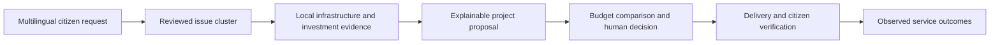

# NVB Analyst Suite: functional audit and challenge improvement plan

Audited on 19 September 2026 against the running localhost app, frontend, API routes and calculation services. This document preserves the original findings and plan. Implementation has since progressed; see [implementation status and acceptance evidence](ANALYST_IMPLEMENTATION_STATUS.md) for the current six-tab workspace and remaining external validation gates.

**Recommendation: make the evidence-to-investment workflow trustworthy before expanding the feature list.** NVB has useful intake, routing, tracking, filtering and analytics foundations. Its weakest part is the connection between citizen evidence, a specific infrastructure proposal, defensible allocation and measured results. Several Analyst screens currently present fixtures or assumptions as verified findings. Fixing that would strengthen the submission more than another advanced-looking tab. A competition result cannot be guaranteed.

The challenge is best demonstrated through one chain:

**Scope and evidence.** All eight Analyst tabs rendered at 1440px; all were checked for document overflow at 390px. No JavaScript page errors or document overflow were recorded in those checks. This does not establish complete accessibility or usability. The audit exercised the scoring slider, a state filter, budget/limit queries and the raw/latent toggle. Stake placement, outbound contact and policy changes were not executed. GET endpoints can write their normal access audit logs.

Evidence is saved in [browser-evidence.json](../scratch/analyst-audit/browser-evidence.json), [shared-metrics-evidence.json](../scratch/analyst-audit/shared-metrics-evidence.json), and eight tab screenshots in [the audit folder](../scratch/analyst-audit). Reproduction scripts are in that folder. Older release-gate reports describe other functional checks; they are not validation of the current statistical claims.

The current demonstration contains **12,500 synthetic requests, 97 districts, three states and three observed languages**. Native-script text and realistic distributions improve the demonstration, but the seeded labels, clusters, lifecycle events and outcomes are not evidence of AI accuracy or real public impact. See [dataset report](demo_dataset_report.json) and [jury walkthrough](JURY_DEMO.md).

## Tab-by-tab findings

| Current tab | What works | Main finding | Recommended disposition |
|---|---|---|---|
| Policy Priority & Simulator | Fetches rankings; budget and limit affect draft selection | Weight sliders do not reach the API; banner, rankings and map use different formulas; displayed projects are district proxies | Keep and rebuild around actual project candidates and reproducible scenarios |
| District Responsiveness (DRI) | Renders and refreshes a league table | All four pillars are hardcoded for six districts, including Bangalore Urban outside this demo's states | Keep operational responsiveness; compute it from events |
| Human-Capital ROI | Executes deterministic arithmetic | Unsupported benefit/cost assumptions, incorrect empty-budget behavior and inconsistent populations/units | Replace with explicit project outcome scenarios; defer monetized ROI until justified |
| Latent Need Surface (VAI) | Raw/latent toggle changes score presentation | Uniform access defaults, unsorted lists, false red-zone fallback and a cosmetic outreach button | Keep inclusion analysis, label uncertainty and connect outreach to a real workflow |
| Data Fusion | Joins eight configured local CSV packs with demand counts | File readiness is presented as official provenance; published checksum fields do not match loaded files | Make this the evidence explorer supporting every recommendation |
| Demand-Decay ROI Tracker | Backend counts pre/post requests and returns cautions | Default post-window is in the future; UI still claims verified resolution; comparator/interval calculations need revision | Keep outcome tracking, gate claims by observation maturity and study quality |
| Bharat Futures Market | Computes weighted fixture opinions and renders controls | Fixed model priors, in-memory stakes, unverified roles, unsupported sanction recommendations | Move to a clearly labelled research area; omit from the main jury story |
| RCT Policy Lab | Renders three example designs | Effects, intervals, telemetry and stopping decisions are fixtures; totals disagree with the fixtures | Retain as future evaluation planning, not a live results engine |

**1. Policy Priority & Simulator — correctness first.**

The sandbox calls `/api/v1/policy/priority-rankings`. The seven-term score is:

`0.22*density + 0.16*velocity + 0.16*deprivation + 0.14*infra_gap - 0.10*investment_penalty - 0.08*relative_cost_penalty + 0.14*equity + co_sign_boost`.

Density, velocity and penalties use cross-district normalization. The coefficients can come from stored scoring profiles. The banner instead advertises a six-component SPS model, which is used by a different endpoint for the overview cards. The map has a third formula. These should not all appear to be the same priority score.

| Metric/control | Actual behavior and limitation |
|---|---|
| Four weight sliders | Changing density to 0.90 left the ranking unchanged. The HTTP request contained only `total_budget_lakh=8500&limit=10`. The projection claimed **55 projects re-ranked and +16.1 lakh beneficiaries** despite only ten returned items. These deltas are frontend arithmetic, not comparisons of scenarios. |
| SPS score /100 | Sandbox score permits negative contributions and is not explicitly constrained to the advertised range. The six-component overview SPS uses proxies for climate and fiscal fit, not IMD observations or scheme eligibility checks. |
| Voices / deduplication | The supposed deduplicated count counts distinct request IDs, then takes the maximum with total complaints. This does not collapse repeated reports of one issue. |
| Estimated cost | Formula: `120 + 12*infra_gap + 150*deprivation_index + 2*complaints`, in lakh. It is not an engineering estimate. More reports mechanically increase cost. |
| Beneficiaries / relative cost | Uses district population for cost comparisons. A district population is not the catchment of a specific proposed asset. |
| Allocated in CAPEX | Greedily funds score-ordered rows if they fit the remaining budget, after truncating to the requested limit. This is a draft scenario, not an administrative allocation or a proven optimal portfolio. |
| Deprivation | Sandbox shows values such as 61 while other panels show 0.61; disclose the scale consistently. |
| Budget and limit | These parameters work. At ₹8,500 lakh/Top 10 the response funded ten district entries using ₹7,301 lakh. The ROI request independently uses a default Top 25 and described eleven allocations. |
| State/category/urgency | The Analyst ranking route ignores these parameters. Overview SPS also ignores them even though the frontend sends them. A Telangana selection changed top counts to 2,500/33 districts while the sandbox still showed all three states. |

Use one versioned scoring definition and one scenario response containing the candidate set, costs, components, allocation, assumptions and deltas. Candidate projects need IDs, service categories, catchments, source clusters, alternative interventions and engineering review status. Show “Selected in draft scenario” until an authorized human approves.

Sources: [dashboard.js](../static/js/dashboard.js), `updateCounterfactualDiffText` and `runAnalystSimulation`; [scoring.py](../visbharat/services/scoring.py), `compute_priority_score`; [intelligence.py](../visbharat/services/intelligence.py), `compute_priority_rankings_with_budget`; [demand_analytics.py](../visbharat/services/demand_analytics.py), `compute_social_priority_score`; [api.py](../visbharat/blueprints/api.py), priority and geo routes.

**2. District Responsiveness — replace the fixture with event calculations.**

The service gets a DB handle but does not query operational events to calculate its values. Karur's 94.1 DRI, 94.5% coverage, 4.2 days, perfect rank agreement and 91% impact are fixed inputs. Requesting Nalgonda still returns all six fixture districts.

| Metric | Current calculation | Required definition |
|---|---|---|
| Coverage | Hardcoded SLA response percentage | On-time first responses / requests eligible for a response-SLA judgment, with window, exclusions and numerator shown |
| Speed | Fixed median days; score `max(0,100 - median_days/14*30)` | Actual median and p90 acknowledgment, sanction and resolution times, separated by urgency and service type; show open-request aging |
| Alignment | Spearman correlation of hand-entered rank lists; mapped to 0–100 | Describe actual decision agreement separately, using the same eligible proposals and dates; disagreement with AI must not automatically imply poor governance |
| Impact | Hardcoded percentage of purported DiD-verified projects | Projects with sufficient follow-up and documented outcomes / eligible completed projects; no causal claim from fixture labels |
| Composite/tier | Equal average of four pillars; fixed tier thresholds | Publish policy rationale and version, show missing evidence, and avoid ranking incomparable case mixes |

The “Unfakeable Cryptographic Event Log” badge is not supported by this calculation. The inspected audit writer inserts ordinary database rows; it does not sign or hash-chain them. Use a precise audit-trail description unless independently verifiable integrity controls are implemented.

Sources: [district_responsiveness.py](../visbharat/services/district_responsiveness.py), [audit.py](../visbharat/audit.py).

**3. Human-Capital ROI — a scenario model needs explicit assumptions.**

The engine assumes children are 28.4% of district population; applies category constants and deprivation multipliers; and calculates “NPV” as `child_population * 0.085 * (1 + deprivation) / 100`. That expression contains no base earnings, cash-flow horizon, discount schedule or intervention cost. It does not establish a monetary NPV, ROI or IRR. The citation strings identify broad report families rather than the study, table, effect definition and applicability needed to justify those coefficients.

At ₹8,500 lakh the tab showed **942,965 cases averted and ₹4,536.92 lakh NPV**. The summary said **zero school-days**, while the KPI showed **18.4k school-days** because JavaScript substitutes a fixture when the API returns zero. Ranking rows lack category and top-level deprivation fields, so the aggregate calculation defaults projects to Water Supply and deprivation 0.65.

At **zero budget**, an empty funded list triggers three fallback projects and **35,950 cases averted, 2,482,137 school-days and ₹694.40 lakh NPV**. This is a release-blocking semantic error.

Start with service-specific physical outcomes: households receiving reliable water, reduced outage hours, travel time, school access. Show a catchment, baseline, expected effect range, time horizon and assumption source. Keep school-days, illness episodes and study-hours in their own units. Return zero planned benefit for an empty portfolio; show unavailable estimates when evidence is insufficient. Compute monetized cost-benefit figures only with a documented model and sensitivity analysis.

Sources: [human_capital_roi.py](../visbharat/services/human_capital_roi.py), `fetchAndRenderHumanCapitalRoi` in [dashboard.js](../static/js/dashboard.js); [rendered evidence](../scratch/analyst-audit/analyst-hc-roi.png).

**4. Latent Need Surface — useful idea, currently an unvalidated access heuristic.**

Current VAI is `clamp(0.45*telecom + 0.40*literacy + 0.15*(1-infra_gap), 0.15, 1)`. Latent score is effective demand per 100,000 people × rounded `1/VAI` × deprivation × 100. Raw score is observed demand per 100,000 × 10. These two scores have different scales and should not be presented as directly comparable volumes.

The reference table used here lacks telecom, literacy and Gati Shakti gap columns, so defaults produce **VAI 0.54 for every returned district**. The API reports 97 analyzed districts but returns the first 50 unsorted; the UI numbers only the first six as if ranked. Raw/latent toggling works, but does not reveal a meaningful rank change. The API reports **zero red zones**, yet `value || 1` displays one. The “6 Wards,” “+14.2%/week,” Karur Block 4 silence and “2,000 households queued” assertions are static; the outreach button only changes its text.

Use genuine district/ward access indicators with year and missingness; treat VAI as a hypothesis until calibrated against independent surveys or outreach. Show observed demand and access risk separately. Rank the complete scoped result before pagination. A zero-report area should prompt investigation, not invented reports. Outreach must have a real eligible audience, authorization, consent/contact rules, queued job ID and delivery result before it is labelled queued.

Demand velocity elsewhere also averages only days with reports. Include zero-report days in a defined calendar window and distinguish an intake-rate level from week-over-week growth.

Source: [demand_analytics.py](../visbharat/services/demand_analytics.py), `compute_latent_demand_surface` and `compute_demand_velocity`; VAI rendering and silence button in [dashboard.js](../static/js/dashboard.js).

**5. Data Fusion — make provenance inspectable.**

The live source-status endpoint reports **eight configured, readable local CSV packs with 97 rows each**. These are SECC, Census, NFHS, SDG, MPI, aspirational districts, Gati Shakti and budget outlays. This is functioning file ingestion, not evidence that the data was independently verified against its stated publisher.

Demand count and high-priority count are real aggregates of synthetic SQLite rows; high priority means Urgent + Emergency. The cards show SECC/MPI values from the loaded packs, but hide six of the joined sources. The source metadata's checksum matches **none of the eight actual loaded files**. Provenance is assigned from hardcoded metadata and any successfully loaded file is labelled official. Missing-source paths can generate baselines; the coverage count includes filled values. The frontend also defaults the active-source label to eight when the fusion response lacks that count.

Add per-field source URL/document, observation year, retrieval time, actual checksum, license, administrative boundary version, geographic join confidence and validation status. Distinguish **file loaded**, **publisher verified**, **derived**, **synthetic**, and **missing**. Use stable state/district codes with crosswalks for post-2011 boundaries. Do not claim every required field is covered simply because eight objects exist.

Make infrastructure gaps category-specific and connect budget evidence to scheme, financial year, geography, sanctioned amount, commitment and expenditure. The current ranking uses local policy decisions as existing investment; it does not consume the budget-outlay pack to establish national-plan alignment.

Source: [layer4_fusion.py](../visbharat/services/layer4_fusion.py), source packs in `static/data/layer4_sources`, and the captured `/fusion/sources` response.

**6. Demand-Decay Tracker — require observed follow-up.**

The frontend always requests the default district, Vellore, with no project or delivery date. The backend defaults its anchor to now and divides post counts by a full future 30-day window. During the audit it returned **83 pre events, zero post events, no linked decision, low reliability and zero baseline-adjusted improvement**. The UI nevertheless displayed **“-100%,” “VERIFIED DECAY” and “100% Resolved.”** It ignores the cautions and never derives that resolution claim from ticket status.

The backend has useful window/category/department/channel parameters and reliability fields, but several statistical issues remain: sanction/creation date can stand in for delivery; a whole-state comparator includes the treatment district; district and state absolute rates have different exposure; the point estimate subtracts two percentage changes while its interval is built from a differently normalized rate difference; seasonality uncertainty is not propagated. For the Nalgonda district/water query, the reported adjusted estimate was **146.05%** with an interval **315.072%–563.393%**, which does not describe the same estimate.

Link the analysis to the delivered asset and its catchment/issue cluster. Require completed observation windows, show observed days and cohort counts, and distinguish decreased reporting from improved service. Present before/after association first. Use a reviewed, consistent estimator with a suitable untreated comparator and diagnostics before causal language. Display interval, sample sufficiency and cautions; never infer success from a future or missing window.

The walkthrough's synthetic Nalgonda example has 32 before/4 after reports for its selected cluster. The broader district/water query returned 33/11 for the specified window. These are different scopes; the UI needs a cluster/catchment filter to avoid confusing them. Neither establishes causal impact.

Sources: [intelligence.py](../visbharat/services/intelligence.py), `compute_demand_decay_impact`; [api.py](../visbharat/blueprints/api.py), decay route; [rendered evidence](../scratch/analyst-audit/analyst-decay.png).

**7. Bharat Futures — optional research, not capital-allocation evidence.**

Four fixture projects have hardcoded contractor/terrain/monsoon priors. Market opinion is weighted `sqrt(points) * role_weight`; the displayed hybrid is `0.45*fixed_prior + 0.55*opinion_share`. This is not a calibrated probability of delivery. Costs, participants, points, priors and recommendations refer to those fixtures.

The stake route accepts a client-supplied identity and expertise role without its own role decorator; stakes live in process memory. Quadratic cost is calculated but no account balance is debited in this service. Thus the claimed credential weighting and manipulation resistance are not established. Recommendations such as immediate sanction/disbursement exceed what this evidence supports.

Remove it from the main policy decision path. If retained later, frame it as structured expert risk review with verified roles, reasons, conflicts, durable records and calibration against completed projects. Do not automatically allocate funds from reputation votes.

Source: [prediction_market.py](../visbharat/services/prediction_market.py), futures routes in [api.py](../visbharat/blueprints/api.py). Stake mutations were not tested.

**8. RCT Policy Lab — present a design, not fabricated trial results.**

`compute_late_causal_effect` returns a fixture. There is no fitted IV estimator, random assignment execution or live treatment-outcome analysis in that function. LATE, confidence intervals, parallel-trend p-values, satellite changes, complaint decay, and early-stop decisions are fixed. The evaluation button displays a fixed alert and reloads.

The three fixture samples sum to **62,100 households and 30 blocks**; headline cards claim **78,800 households and 34 blocks**. The +26.4% mean lift and two auto-scaled trials are hardcoded. The listed outcomes have different meanings, so a simple mean causal lift would be inappropriate even if computed. A non-significant pre-trend test alone does not prove valid causal identification.

Move this to evaluation planning: outcome definitions, eligibility, rollout schedule, sample-size assumptions, preregistration and human approval. Live trials require an appropriate reviewed design, real assignment/compliance/outcome data and valid inference for clustering, time effects and any adaptive stopping. Do not display “LIVE RCT,” “proof,” consent verification or automatic rollout success without that evidence.

Sources: [rct_experimentation.py](../visbharat/services/rct_experimentation.py), `loadRctPolicyLab` and `triggerRctMabEvaluation` in [dashboard.js](../static/js/dashboard.js).

## Shared Analyst metrics and controls

| Metric/view | Audit result | Improvement |
|---|---|---|
| Citizen Requests | 12,500; full filtered BigQuery count in this runtime | Keep; expose period, synthetic/live split, source and refresh watermark |
| Languages | Three distinct input languages; Telangana shows two | Label “Languages represented”; separately report languages supported and evaluated |
| Districts / States | 97 / 3; Telangana correctly shows 33 / 1 | Keep; distinguish represented geography from national deployment coverage |
| Resolution rate | Rounded 26%; dataset has 3,262 Resolved/Closed of 12,500 = 26.096% | Label operational closure; separately show citizen-confirmed resolution and reopened rate |
| Demand trend | Full aggregate, displayed for the selected recent period; 14 days in this run | Fill zero days, show year/timezone and window; do not imply observed growth in a synthetic corpus is a national trend |
| Category chart | Totals reconcile to 12,500 across ten categories | Keep; global filter currently exposes only six categories—include all supported categories |
| Urgency chart | Uses latest 500 records: 203 Emergency, 79 Urgent, 218 Routine | Query complete aggregates. Its displayed 40.6% emergency share differs greatly from the dataset's 4.2% |
| Channel chart | Also only 500; groups SMS and Email/Open API into Web Form | Aggregate full scope with canonical channel IDs; preserve seven actual source types or explicitly label grouping |
| Hotspot map / Spend | Unfiltered demand uses aggregates; category/urgency filtering calls a helper capped at 500 rows. “Spend” is sum of approved/funded local policy estimates | Aggregate the full filtered scope; distinguish estimates, approved commitments and actual expenditure; show comparable periods/geographies |
| Demand–Spend Gap | Subtracts rupees-in-lakh from number of complaints | Replace with a defined comparable index, e.g. service deficit and investment adequacy, each normalized and explained |
| Map priority / risk | Priority differs from both SPS models; risk is a heuristic stress score divided by 100 | One canonical priority model; call stress a screening index until a forecast is evaluated |
| Next-quarter forecast | Counts multiplied by `1 + 0.6*risk`; no validated time-series inference in this path | Label scenario projection or replace with backtested forecasts and uncertainty; compare with a simple baseline |
| Overview priority cards | Six-factor SPS uses saturated volume, proxy climate/fiscal scores, fixed impact gains and scheme text | Explain components honestly; attach evidence; stop generic scheme matches or fixed benefit promises |
| Generate policy brief | Source review: district counts/top categories feed the generator; retrieved citations are appended separately. The inspected retrieval code uses keyword overlap even when it obtains a query embedding | Pass verified source excerpts and the scenario into generation, require claim-level citations, identify fallback output, and recover the button after errors. Live generation quality was not evaluated in this audit |
| Global filters | Top stats update, but SPS ignores supplied filters and Analyst subtabs do not consistently receive them | Shared scope object across views; scope badges, explicit exclusions, zero-results state, no silent fallback to national totals |
| Freshness / runtime | Suite freshness is browser fetch time. “Overall: LIVE” is based on client/configuration flags | Separate dataset as-of, source load, calculation time, successful provider invocation and configured capability |
| Insight summary | Combines top stats with independently fetched priority cards | Bind both to the same scope/version and render atomically to avoid contradictory summaries |

Sources: [dashboard.js](../static/js/dashboard.js), `loadStats`, `loadCharts`, `loadHotspots`, `loadPrediction`, `loadAiRuntimeStatus`; [dashboard-ui.js](../static/js/dashboard-ui.js); [api.py](../visbharat/blueprints/api.py), stats, SPS and geo routes. Supplemental evidence confirms that SPS responses were identical with and without Telangana/Health/Emergency filters. Individual localhost queries took about 73–78 ms for SPS, 3.5 s for rankings and 2.1 s for a geo layer; these single observations are not load-test percentiles.

## Proposed Analyst experience

Use six task-oriented tabs, with technical methods available inside the relevant evidence panels:

| Proposed tab | Policymaker's question | Essential content/action |
|---|---|---|
| Demand & Inclusion | Where are the problems, and whose needs might be missing? | Complete filtered counts, distinct issues versus reports, multilingual examples, urgency, normalized hotspots, access-risk uncertainty |
| Evidence & Gaps | What corroborates the need, and what is already planned? | Source explorer, service-specific coverage, demographics, scheme/investment overlap, missing data and boundary matching |
| Project Priorities | Which specific intervention should we consider, and why? | Cluster-linked proposal, alternatives, catchment, costs/ranges, implementing agency, score contributions, human review |
| Budget Scenarios | What can we fund, and what tradeoffs follow? | Baseline/scenario comparison, budget constraints, geographic equity, capital and operating cost, unfunded urgent needs, exportable decision brief |
| Delivery & Responsiveness | Are approved interventions being delivered? | Event-based SLA/aging, project milestones, commitments versus spending, ownership, citizen updates and reopen reasons |
| Outcomes & Evaluation | What improved, and how strong is the evidence? | Completed follow-up windows, service measures, citizen confirmation, reporting changes, cautious comparisons and future evaluation plans |

Do not duplicate the existing execution queue, citizen timeline or approval workflow. Connect them by request → cluster → proposal → decision → delivery → outcome IDs. Keep technical experiments in an optional Research area.

## Implementation sequence and acceptance gates

Effort ranges below are rough engineering estimates for the current codebase, not calendar commitments. Obtaining and validating external data can take longer.

| Priority | Work package | Approximate effort | Acceptance gate |
|---|---|---|---|
| P0-A | Truthful labels and zero/missing/error handling | 1–2 days | No fabricated success on zero or failed requests; empty portfolio has zero planned benefit; no fixture displayed as live/verified; no future window treated as observed impact |
| P0-B | Shared filters, full aggregates and consistent calculations | 2–3 days | For state/district/category/urgency/date scope, every applicable view reconciles to independent SQL; all ten categories; scope survives tab changes; urgency/channel totals equal scoped request count |
| P0-C | One scenario model and real weight controls | 2–3 days | API accepts validated scenario weights without changing the active policy profile; components reproduce score; displayed formula matches response; same inputs reproduce results; displayed deltas equal actual baseline/scenario differences; budget/ROI share candidate IDs |
| P1-A | Traceable proposal and evidence explorer | 3–5 days | Each showcased proposal links real source ticket/cluster IDs, native/translated text, reviewed category, catchment, source records, cost basis, eligibility caveats and alternatives; a reviewer can reproduce why it ranks where it does |
| P1-B | Operational responsiveness and honest outcomes | 2–4 days | All supported districts use event-derived metrics with eligible denominators; delivery date and observation maturity are explicit; reopen/confirmation visible; no causal label without approved methodology and supporting data |
| P2-A | AI evaluation, performance and Digital Public Good package | 3–5 days plus evidence collection | Publish reproducible quality and load results, deployment/federation instructions, model/data limitations and privacy/access controls; distinguish measured from planned capabilities |

P0 comes first. P1-A depends on the shared scope and scoring contract. P1-B can reuse the existing lifecycle data once its metric definitions are agreed. P2 documentation can progress alongside implementation, but its results must describe the final build. Do not spend the first sprint implementing a market or trial engine.

**Metric contract for all new work.** Every KPI should return a name, value, unit, numerator/denominator where applicable, scope, observation window, source reference, as-of time, data mode, calculation version, assumptions and quality status. Unknown is distinct from zero. Synthetic is distinct from observed. A scenario is distinct from an approved decision.

**Scoring and budget acceptance.** Use a single documented scoring vocabulary and service-specific project candidates, preserving a simple explainable method until evidence warrants added complexity. Avoid double-counting the same need through volume, density, velocity and co-signs. Keep emergency service response separate from long-term capital prioritization. Compare feasible portfolios under budget, minimum service/equity constraints, implementation capacity, recurring cost and existing commitments. Demonstrate the actual tradeoff; do not force a predetermined district to win.

**Data and quality acceptance.** Validate official documents and actual imported file hashes before labelling sources verified. Test geographic matches, missing fields, stale years and no-data scopes. Show priority sensitivity to uncertain costs/indicators. Seeded cluster labels may support demonstration and smoke checks, but AI evaluation needs an independent held-out, human-reviewed set.

**AI evidence that would improve the submission.** Start with the three demonstrated languages, then extend geography/languages through the same schema and evaluation process. Publish category macro-F1, urgency confusion matrices/emergency recall, location extraction accuracy, duplicate-cluster precision/recall, and human-reviewed translation/ASR errors by language and channel. Include code-switching, noisy audio, negation and location ambiguity. Use a separate holdout; label sample sizes and limitations. Report provider fallback/abstention and reviewer correction. Do not substitute a provider's configured status for measured quality.

**Scale and Digital Public Good evidence.** Existing assets include an Apache-2.0-labelled license, federation JSON schemas, API examples, channel connectors, worker/queue code and release checks. Build on these. Demonstrate replay/idempotency and retry behavior on an isolated test deployment; measure p50/p95/p99 latency, throughput, failure rate, queue age and cost per request at declared sizes/concurrency, including a larger synthetic corpus. Preaggregate filtered analytics instead of repeatedly scanning/loading rows for every widget. Show an independently installable deployment, documented adapters, stable geographic codes, export/import round-trip, role enforcement, data minimization and a practical correction/retention process. These establish readiness toward a DPG; no certification is asserted.

## Jury demonstration after the fixes

Aim for an eight-minute evidence-led demonstration. Present the three-state pilot scope clearly.

1. **0:00–1:15 — Citizen voice.** Submit a Tamil or Telugu request through the demonstrated live channel. Show transcript/translation, allow correction, then show the standard ticket ID, department and acknowledgment. State which steps invoked a live provider.
2. **1:15–2:15 — Consolidation.** Open related reports from another channel, explain the shared issue cluster and distinguish reports from unique issues. Preserve an emergency hazard as an immediate response case, not a capital-budget waiting item.
3. **2:15–3:30 — Need and inclusion.** Show a hotspot and a potentially underserved area using population/service-access evidence. Open the source, date and uncertainty. Explain that fewer complaints can reflect access barriers.
4. **3:30–5:00 — Proposed solution.** Open one specific infrastructure proposal. Trace its source requests, local service deficit, existing investment/scheme overlap, alternatives, cost range and implementing authority. Explain why it outranks an alternative using actual score contributions.
5. **5:00–6:15 — Budget decision.** Change a budget or equity preference; show real changes in selection, cost and expected coverage. Explain what remains unfunded and why. Export a cited decision brief for human approval.
6. **6:15–7:15 — Delivery and outcome.** Open a completed synthetic example such as Nalgonda; show lifecycle events, citizen feedback and comparable observed windows. Say “illustrative decrease in reports,” not causal proof or realized national savings.
7. **7:15–8:00 — Reuse and evidence.** Show measured language/scale results, installation/federation artifacts and what another state must configure. Close with the concrete policy decision NVB helped make.

The strongest differentiator is a reviewer being able to follow a recommendation all the way back to the citizen and source evidence, change a policy assumption, see the resulting tradeoff, and later check delivery. That directly addresses fragmented feedback, misaligned investment, infrastructure gaps and unmeasured outcomes.
