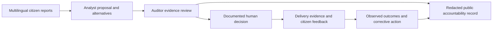

# NVB Auditor Suite: functional audit and implementation plan

Audited on **19 September 2026**, against the running localhost dashboard, API responses, SQLite records and source code. **Status: the implementation packages are complete for the local demonstration.** See [implementation status and measured verification](AUDITOR_IMPLEMENTATION_STATUS.md) and [deployment/API instructions](AUDITOR_DEPLOYMENT_AND_API.md). External source authentication, representative human labels, field outcomes and production deployment remain explicit evidence gates.

The findings and proposed targets below preserve the original pre-implementation assessment; they do not describe the upgraded application's current behavior.

**Recommendation: make the Auditor Suite the evidence and accountability layer for the Analyst's proposals.** Its most valuable question is: “Can a reviewer trace this recommendation to citizen needs, verify the supporting evidence, challenge a decision and check delivery?” Several current screens instead present illustrative calculations as verified results. Correcting that gap will make NVB's challenge submission more credible than adding more advanced-looking metrics. An award cannot be guaranteed.

The intended challenge story is:

## What was checked

- All six tabs rendered at desktop width 1440px and mobile width 390px. No JavaScript page errors or document-level horizontal overflow were observed. This is not a complete accessibility certification.
- Checked state filtering, latest-record search, CSV row counts, API authentication for audit logs, consent response shape, source linkage, metric formulas and limited response timings.
- Isolated browser checks reproduced stale DiD values after an intercepted HTTP 404 and confirmed that HTML supplied as an audit actor becomes markup. No script exploit was executed or inserted into the database.
- Browser API mutations were blocked. No decisions, demand records, financial instructions, satellite ingestion, audit dispatches or external notifications were submitted. Normal GET access logging occurred.
- One live AI telemetry API timing and three ordinary log API timings were collected. They are small localhost observations, not load-test percentiles or national-scale evidence.

Evidence: [database inventory](../scratch/auditor-audit/database-inventory.json), [API observations](../scratch/auditor-audit/api-evidence.json), [browser observations](../scratch/auditor-audit/browser-evidence.json), [isolated calculations](../scratch/auditor-audit/metric-evidence.json), and [screenshots/reproduction scripts](../scratch/auditor-audit/).

## Current data and consistency

| Item | Observed result | Meaning |
|---|---|---|
| Citizen demands | 12,500 synthetic records; live telemetry reports BigQuery as its source | Suitable for exercising a demo; not evidence of real outcomes or independently measured AI accuracy |
| Audit events | 3,195 at the initial snapshot; reads subsequently added entries | Use a recorded snapshot when reconciling counts |
| Audit events with a hash | 15 of those 3,195 had a nonempty `current_hash` | Hash presence alone does not establish validity or complete coverage |
| Chain verification | `valid: false`, broken at event 82 after inspecting 81 entries | The static “Hash Head Active” card does not reflect actual verification |
| Consent ledger | 200 events, all granted; zero linked to the current 12,500 request IDs | Demo cohorts are disconnected. Consent coverage of this request corpus cannot be inferred from the old ledger |
| Policy decisions | Zero; two legacy Karur control records, neither linked to a current decision | Current DiD results are not an evaluation of an approved Analyst project |
| Satellite signal records | Six, labelled `google_earth_engine`; two feed projects have attached records | Stored provider labels/URIs do not authenticate observations or establish construction progress |
| Security query matches | 362 audit actions matching keywords at snapshot time | Not 362 verified security incidents |

The eight reference datasets already shown in the Analyst evidence explorer should retain their actual verification state. A loaded file, SHA-256 digest or government publisher name establishes neither publisher authenticity nor correct figures. The Auditor should show publisher URL, exact release/table, observation period, applicable redistribution terms, geography crosswalk, reviewer and review date before marking a source independently verified.

## Tab-by-tab assessment

| Current tab | Working capability | Main issue | Recommended direction |
|---|---|---|---|
| Causal DiD Auditor | Authenticated endpoint, controls display, refresh | Fixed impact, confidence interval and pretrend claims; stale values survive errors | **Outcomes & Evaluation:** observation maturity, real service outcomes and a gated evaluation design |
| Provenance Lineage Graph | Readable card; live aggregate telemetry below it | Static tender/signature/budget claims; AI quality and bias numbers lack valid definitions | **Evidence & Decision Trace:** interactive evidence trail; put model evaluation in a clearly separate AI quality section |
| Audit Logs | Authenticated list and CSV export | Latest-100 search, different export scope, truncated context, HTML injection, incomplete hash coverage | **Audit Trail:** full server search, ticket/project drill-down, integrity status and reproducible export |
| DPDP Consent Ledger | Backend stores scope, basis, language and grant flag | UI reads wrong field and displays green “Nominal”; old events are unlinked | **Consent & Data Rights:** correct receipts, current state, purpose/basis, withdrawal and request linkage |
| Security Alerts | Lists keyword-matched log events with local filters | Normal alert-history reads are reported as incidents; no case lifecycle | **Security & Exceptions:** structured detections, coverage, severity, owner, due date and closure evidence |
| Anti-Capture Satellite Triangulation | Loads three project examples and has a local simulator | Fixture verdicts, inconsistent scores, unsupported frozen-money/precision claims and fake dispatch | **Delivery & Financial Review:** milestone evidence, discrepancies and human-reviewed cases |

Keep six primary tabs. Make Evidence & Decision Trace the landing tab and show a small review queue there. Move AI Quality into a named section/subview instead of hiding it under a cryptographic card. Do not add a seventh top-level tab until there is enough evaluated data to justify it.

### 1. Causal DiD Auditor

The live API returns **−74.0%**, a **95% interval of [−79%, −69%]**, **SMD 0.042**, **p = 0.88** and **“IMPACT VERIFIED.”** The service sets treated decay to −0.78 and control decay to −0.04, then constructs the interval as estimate ±5. It does not estimate these quantities from observed outcome data.

Other issues:

- The matching pool has six hand-entered geography vectors, including Bangalore Urban outside this demonstration's three states. An unknown treated district falls back to Karur during control selection.
- Ordinary Euclidean distance is labelled “Standardized Mahalanobis.” The reported SMD is not a per-covariate standardized mean difference; values above 0.08 are replaced with 0.042.
- The stored pretrend p-value is fixed at 0.88. Even a valid nonsignificant pretrend test would not prove equivalence or establish parallel trends.
- The short PAP hash identifies generated metadata, not an independently timestamped preregistered analysis plan.
- The GET path can seed controls when absent. Viewing a result must not create an evaluation design.
- Frontend defaults overwrite legitimate zero SMD/p-values, and the error state changes only the verdict. The browser reproduced an “Unavailable” verdict alongside the previous −74% result and “EXCELLENT” balance.
- The escalation filmstrip is a fixed story ending “Work order closed & verified.”

**Required behavior:** show “Evaluation not ready” until a project has a delivery date, an outcome definition, appropriate observed pre/post periods and the required evidence. Reuse Analyst outcome observations and distinguish completed work, citizen confirmation and measured service improvement. Complaint reduction can also reflect channel outages, access changes or seasonality.

Before any causal estimate, record intervention dates, eligible units, comparison selection, pre-treatment covariates, exclusions, baseline version, outcome units and a reviewed inference method. Report group sample sizes, missing periods, balance by covariate, pretrend plots and uncertainty. Use an appropriate design for timing and clustering; do not apply a simple DiD blindly to staggered interventions. Express a difference of percentage rates in **percentage points** unless a relative estimand is explicitly defined. A synthetic walkthrough must remain labelled illustrative at every step.

Sources: [causal_matching.py](../visbharat/services/causal_matching.py), [API](../visbharat/blueprints/api.py) `get_auditor_did_proof_secure`, [dashboard.js](../static/js/dashboard.js) `loadAuditorDidProof`.

### 2. Provenance and AI telemetry

The provenance card has a fixed ₹420 crore pipeline, tender number, officer name, budget line, “Digitally Signed,” “X.509 Certificate Valid,” “Reconciled” and “Last Merkle Audit: 12 days ago.” These labels are not driven by document, certificate or reconciliation checks. The live chain verifier reports failure.

The AI telemetry endpoint does retrieve actual counts. It then converts resolution rate and number of observed languages into drift/bias/quality heuristics. The configured live path calls an infrastructure stress predictor and relabels its output as model drift. A separate Gemini branch asks for numerical governance scores from aggregate counts. Neither path measures labelled prediction errors or fairness.

| Current metric | Finding | Replacement |
|---|---|---|
| Model Drift Score: 0.62 | Stress/heuristic result; demo calibration caps scores below the Critical threshold of 0.65 | Distribution change against a stored baseline, separately from measured prediction-quality drift |
| Bias Risk Index: 64.9% | Formula-derived; cap of 64.9 prevents High threshold 65 | Per-language/region error rates and gaps on a reviewed evaluation sample, with sample sizes and uncertainty |
| Data Quality Score: 70.4% | Derived from drift/diversity rather than record checks | Explicit completeness, valid geography, dates, duplicate rate, source linkage and required-field checks |
| Anomaly Count (24h): 150 | Derived from all-time total and score; no 24-hour event query | Count of distinct qualifying detection events in the stated observation window |
| Language/state/channel “Fairness Slice” | Frequency is not fairness; top-four percentages use a truncated denominator | Rename “intake distribution”; include all groups or an “Other” group against the complete scoped total |
| Confidence: 0.8 | Provider/default confidence is not demonstrated calibration of governance metrics | Report calibrated confidence only where evaluated; otherwise provider output with explicit meaning, or unavailable |
| Recompute Baseline | Changes mitigation text; does not persist a newly evaluated baseline | Authorized asynchronous evaluation job with dataset/model versions, status and a reviewable result |

Concrete denominator error: Voice IVR is **3,580 / 12,500 = 28.64%** of requests. The screen shows **35.7%**, because its four displayed channels total 10,027 and omit 2,473 records. Three language and state groups happen to fit within the limit; that does not make the general implementation correct.

The `DEMO_RISK_CALIBRATION` option defaults to true and suppresses high severity through numeric caps. “Sustained windows” are counters advanced by requests in process memory, not distinct time windows. Repeated refreshes must not change the underlying risk state. UI risk styling also renders unfamiliar bands such as “Watchlist” as green by default. The provider badge says Vertex AI for any live model branch, including Gemini.

**Required behavior:** attach evidence to the actual Analyst project/scenario/decision IDs. Each node should show origin, observation date, received date, data mode, verification status and a readable preview. Show request → cluster → reference indicator → score version → proposal → engineering review → decision → milestone → outcome. Keep raw JSON and cryptographic details expandable. An AI explanation may summarise validated calculations; it must not invent validation numbers.

Sources: [dashboard template](../templates/dashboard.html), [API](../visbharat/blueprints/api.py) `get_auditor_ai_telemetry`, [legacy panel](../visbharat/panels/auditor.py).

### 3. Audit Logs

The list correctly requires an Auditor/Admin token; an unauthenticated read returned HTTP 401. The UI displays 100 rows, but search only inspects those cached rows. Searching for `citizen_request_submitted` returned no results although the initial database snapshot contained 194 such events. Resource IDs are returned by the API but not shown in the table; details are truncated to 80 characters without a detail view.

CSV exports the latest 500 independently of visible search. The list serializes identical records under `audit_logs`, `logs` and `items`, tripling the row data. `limit=-1` bypassed the limit and returned **3,204 rows / 3.72 MB**. An invalid text limit returned HTTP 400, as expected.

The HTML rendering inserts actor/action/details directly into `innerHTML`. A harmless isolated actor value containing a `<b>` element rendered as markup. This confirms an injection sink; arbitrary script execution was not tested. CSV cells are emitted without spreadsheet-formula neutralization.

The ordinary writer does not populate hashes. A separate chain writer uses the latest row's hash, so mixing unhashed writes can restart a chain. The verifier skips recomputation for missing hashes and inspects only the first 500 rows. An isolated entirely unhashed row returned `valid: true` and “Cryptographic integrity verified.” A linked hash chain is also not a Merkle tree or proof of publisher authenticity.

**Required behavior:** one append-only event contract and integrity strategy, covering actor identity, resource ID, before/after changes, reason, event time, correlation ID and sequence. Preserve legacy unverified entries as legacy; do not backfill hashes and imply they were protected at creation. Verify completeness and sequence through the declared head, expose verified/unsigned/failed counts, and anchor checkpoints separately if claiming resistance to administrative rewriting. Add transactional ordering/concurrency safeguards.

Add cursor pagination and server filters for ticket/project/decision, actor, action, event date and geography where linkable. Exports must use the identical scope and snapshot, include a manifest, and redact restricted details. Use text nodes or escaping; validate limits on both ends. Keep security/access logs but separate routine view events from material decision changes in the default view.

Sources: [audit.py](../visbharat/audit.py), [chain.py](../visbharat/log/chain.py), [API](../visbharat/blueprints/api.py) audit routes, [dashboard.js](../static/js/dashboard.js) audit rendering/search/export.

### 4. DPDP Consent Ledger

The API returns `ledger.items`; the UI reads `events` or top-level `items`. Ten records were returned in the live check while the screen showed green **“DPDP Act 2023 Consent Ledger Nominal.”** If cards did render, they would all say “Granted,” ignore a false grant flag/legal basis and use fallback ID 101 rather than `event_id`.

The intake helper defaults a missing `consent_granted` to true and uses `bool(...)`, so a string such as `"false"` would be truthy. No withdrawal, erasure or correction workflow was found in the inspected Python application. Existing documentation about such handling is not an implemented rights-request workflow.

**Required behavior:** validate an explicit boolean when consent is the applicable basis; record purpose, notice version, language, channel, event time, basis and receipt reference. Derive current state from the event history rather than treating every past grant as current. Demonstrate granted, declined, withdrawn, superseded, missing and non-consent-basis states. Show “Not linked / coverage unknown” for the current cohort instead of claiming compliance. Synthetic requests should have synthetic receipts in a separately identified demo cohort, not retroactively invented real consent.

Build a rights-request workflow with receipt, identity checks appropriate to the channel, scoped action, due date and completion evidence. Withdrawal affects applicable future processing; retention/legal-hold decisions must have documented reasons. Separate those effects from lawful retention of necessary audit evidence. A consent ledger alone does not certify legal compliance. Subject references must not be globally derived from “anonymous” for unrelated citizens, and pseudonymous identifiers still require access controls.

Sources: [governance.py](../visbharat/services/governance.py), [API](../visbharat/blueprints/api.py) `_record_ingest_consent` and consent routes, [dashboard.js](../static/js/dashboard.js) `loadConsentLedger`.

### 5. Security Alerts

The backend matches action strings containing `security`, `tamper`, `denied` or `alert`. The 50 displayed results were MEDIUM and consisted of alert/history-view actions, not confirmed incidents. Local search/severity/type filters work only over this page. Severity is HIGH for `tamper`, otherwise MEDIUM.

The empty state claims webhooks, tokens and consent nodes operate nominally, despite not checking those systems. `require_auth`/`require_roles` return denials without writing detection events in those decorators. Other monitoring may exist, but this feed does not demonstrate comprehensive coverage.

**Required behavior:** use typed events for authentication failures, role/scope violations, invalid webhook signatures, replay, integrity failures, abnormal export/access patterns and pipeline gaps. Define severity from rules with evidence and a version. Exclude ordinary view events from incident counts. Group repeated detections into cases without losing underlying events. Show open/acknowledged/investigating/resolved states, owner, deadline and remediation verification. Display coverage/freshness of each detector; “No events observed” must be distinct from “Detector unavailable.”

Sources: [auth.py](../visbharat/auth.py), [API](../visbharat/blueprints/api.py) `get_security_alerts_secure`, [dashboard.js](../static/js/dashboard.js) `loadAdminSecurityAlerts`.

### 6. Anti-capture, satellite and financial review

Three fixed project examples supply citizen counts/quotes, photo scores, expenditure percentages and verdicts. The header advertises live providers regardless of the provenance of each observation. The service optionally attaches the latest satellite record but leaves the original score/verdict intact.

| Project | Displayed score | Formula on original fixture | Formula using current feed values |
|---|---:|---:|---:|
| Karur | 0.74 | 0.75 | 0.71, satellite 41.2% |
| Vellore | 0.11 | 0.19 | 0.20, satellite 52.7% |
| Tirupati | 0.69 | 0.67 | 0.67, satellite 31.0% |

These calculations reproduce the existing formula; they do **not** validate it as a fraud detector. Spending percentage, complaint severity, image-defect scores and remote-sensing indices have different meanings. Disbursement can precede construction, and low complaint volume does not establish sound delivery.

- **₹142.5 crore frozen** and **94.2% audit precision** are fixed frontend text, not reconciled finances or reviewed detection performance.
- Dispatch is a browser alert declaring a team dispatched and funds frozen. It does not call a dispatch system. The separate POST route also returns these states without a persisted case/financial instruction, lacks a role decorator and accepts the claimed actor from the client. It was not invoked in this audit.
- The local slider simulator updates the score but uses approval/freeze language. The POST simulator's `or` defaults also replace legitimate numeric zero inputs.
- The feed discards a satellite value of zero through a truthiness fallback, and does not validate the provider merely by storing its name.
- Earth Engine service fallback returns a deterministic random proxy with a Google provider label and a simulated-mode field inside provenance. Even the live path converts an NDBI/NDWI composite to a bounded “progress percentage,” defaults missing geography to Chennai, and has fixed cloud-cover metadata. These observations do not establish completed work. Request time is not necessarily imagery observation time.

**Required behavior:** link a real project, work order, milestone, sanctioned amount, released amount, actual expenditure, engineer-certified physical progress, site evidence and citizen service feedback. Compare matched milestones and periods. Clearly distinguish uploaded evidence, authenticated agency records, satellite proxies, AI interpretations and reviewer determinations. Preserve zero values and show unknowns explicitly.

Use “Discrepancy requires review” with reasons and source quality, then a persisted case with assignment, evidence requests, independent verification and closure. A human with financial authority must decide any hold through an authenticated integration and receive an acknowledgment. A local case cannot claim that government funds were frozen. No accusation or disbursement approval should follow automatically from the heuristic.

Satellite evidence needs project geometry, sensor/image IDs, acquisition dates, pixel/cloud quality, before/after method and suitability limits. Buried pipes, water quality and many health services need field/service measurements. Review false positives such as clouds, timing mismatch, legitimate advances and imagery covering an adjacent asset.

Sources: [anti_capture_triangulation.py](../visbharat/services/anti_capture_triangulation.py), [earth_engine.py](../visbharat/services/earth_engine.py), [API](../visbharat/blueprints/api.py) anti-capture routes, [dashboard.js](../static/js/dashboard.js) `loadAntiCaptureTriangulation`, `runAntiCaptureSimulation`, `dispatchThirdPartyAudit`.

## Shared scope and metric contract

State, district, project and date context must be visible on every tab and returned by each API. In the browser, selecting Telangana still showed Karur, Vellore and Tirupati anti-capture projects. AI telemetry, logs, consent and security calls omit these global filters. DiD sends district only and defaults to Karur for all-state views.

Reuse `analyst_workbench.scope_from`, canonical request/cluster/project IDs, `policy_decisions` and Analyst evidence/outcome services. **Do not copy their data into another disconnected demo pipeline.** Geography needs stable codes and reviewed crosswalks, with unresolved joins explicit.

Different dates have different meanings: citizen intake date, audit event date, imagery observation date, payment date and outcome window. Use an explicit applicable date selector per view; do not silently apply intake filters to source files or claim that global security events belong to a selected district. Show unlinked/global records separately. Category and urgency apply to linked demands/projects where meaningful.

Every metric should return: definition/version, value/unit, numerator/denominator where applicable, scope, observation window, as-of time, data snapshot, source/evidence IDs, real/synthetic mode, missingness and status. Statuses should include **observed**, **illustrative**, **insufficient data**, **verification pending** and **failed**. Zero is not missing; missing data is not a successful check.

| Proposed metric | Definition and gate |
|---|---|
| Proposals ready for audit | Eligible proposals satisfying their versioned required-evidence checklist / eligible proposals; show missing items |
| Source verification coverage | Independently checked source assets / relevant source assets, with failed/pending counts; not a claim of data completeness |
| Audit integrity coverage | Events with successfully checked hashes and links / events in the declared interval, plus sequence/head completeness |
| Open/overdue exceptions | Distinct persisted cases in those states at as-of time; exclude routine access logs |
| Documented processing-basis coverage | In-scope requests with a valid linked purpose/basis receipt / applicable requests; distinguish missing receipts and synthetic cohorts |
| Consent withdrawals pending | Actionable withdrawals without completed processing action, with age and justified retention exceptions |
| AI quality | Category macro-F1, emergency recall, translation/location review accuracy and duplicate-pair precision/recall from a reviewed holdout |
| Voice quality and inclusion | WER/CER on labelled audio by language/noise group; error gaps and sample sizes; intake volume is reported separately |
| Model/data drift | Versioned reference/current distributions and an appropriate test/statistic; quality degradation requires labelled outcomes |
| Financial discrepancy | Comparable milestone/period mismatch in documented amounts or certified progress; show reconciliation rules, not a fraud probability |
| Detection precision | Independently confirmed flags / adjudicated flags, with sample size, interval and unreviewed share; pending cases are not negatives |
| Delivery verified | Eligible completed milestones with required independent evidence / completed milestones reviewed; identify reviewer and criteria |
| Citizen confirmation | Confirming respondents / eligible respondents, with response rate and possible nonresponse bias |
| Service outcome | Measured change in service availability, travel time, water quality or another project-specific outcome, with units and window |
| Evaluation readiness | Checklist state: protocol, dates, baseline, comparator, observation maturity, missingness and reviewed method; no generic success percentage |

## Performance findings and changes

| Endpoint | Observed elapsed time | Payload / limit |
|---|---:|---|
| Audit logs, 100 records | 29.5–32.9 ms across three reads | About 105–107 KB because of repeated row arrays |
| Audit logs, `limit=-1` | 151.2 ms | 3.72 MB; unbounded-limit bug |
| Consent, 10 records | 24.0 ms, one read | 3.9 KB |
| Security, 50 records | 25.8 ms, one read | 36.2 KB; duplicate array aliases |
| DiD | 5.6 ms, one read | Fast fixture arithmetic, not computation-performance evidence |
| Anti-capture feed | 9.3 ms, one read | Three examples and local signal lookups |
| AI telemetry | **4,128.5 ms**, one read | BigQuery aggregates and a reported live Vertex backend |

The telemetry code performs four aggregate queries, a fifth emergency-count query on the Vertex path, and a provider call per request. CSV repeats the computation. A 30-second refresh loads DiD, telemetry, logs, consent and charts even when another Auditor tab is open. Navigation also refreshes shared AI status. The browser recorded five telemetry requests and 19 AI-status responses during this walkthrough; its deliberate navigation and filter tests contributed to those counts. This is not a steady-state traffic estimate.

Implement:

1. A versioned scoped snapshot with consolidated SQL/preaggregates; no provider calls during ordinary tab rendering. Persist model evaluations as explicit bounded jobs. Export the displayed snapshot rather than reevaluating it.
2. Lazy loading for the active tab, request deduplication, cancellation/sequence checks on scope change, pause polling when hidden, and per-panel freshness rather than one misleading suite timestamp.
3. Cache by authorized scope, data version, metric version and model/evaluation version. Make caches tenant/role safe; use an explicit stale state and invalidate after relevant evidence changes.
4. Cursor pagination with positive bounded page sizes, stable event ordering and identical server search/export filters. Add measured indexes for event time/resource, consent request/purpose/time, cases state/due date and satellite project/type/observation time.
5. BigQuery partition pruning, parameterized filters, query deadlines, bytes/cost limits and observable cache hit rates. Fetch latest satellite records in one query as project counts grow. Bound external provider jobs with retry/circuit-breaker behavior.
6. Durable time-window evaluation and incident state shared across workers. Refresh requests must not create new “breach windows.”

**Proposed acceptance targets, not achieved results:** at 100,000 requests / 1,000,000 audit events and 20 concurrent authenticated readers, warm cached snapshot p95 ≤500 ms, uncached scoped snapshot p95 ≤2 s, paged log search p95 ≤500 ms, and first useful Auditor content within 2 s on an agreed demo network/device. Ordinary tab GETs should make zero model calls. Use a 100-row page payload budget of 75 KB, with large details fetched separately. Agree workload/hardware and revise targets from measurements rather than claiming scale from a fixture response.

A dedicated benchmark must record cold/warm p50/p95/p99, throughput, errors, DB/query time, bytes processed, provider calls/cost, queue delay and snapshot age. Exercise repeated filters, large exports, multiple workers, cache invalidation and unavailable providers. Existing Analyst benchmark results do not validate Auditor performance.

## Ordered implementation plan

| Priority / package | Concrete deliverable | Acceptance gate |
|---|---|---|
| **P0-A — Remove unsupported success claims** | Retire fixed causal/provenance/precision/frozen-money claims; remove risk caps; explicit demo/unknown/error states; clear stale results; disable fake dispatch/approval outcomes | Missing data, zero values and provider errors never display verified success; sliders affect only labelled simulation; all legacy callers follow the same rule |
| **P0-B — Fix contracts and security boundaries** | Correct `ledger.items`/event state; escape untrusted fields; safe CSV; bounded limits; authenticated case actions and server-derived actor; GETs cannot seed evaluation records | Granted/declined/withdrawn/missing cases render correctly; unauthenticated and unauthorized actions fail; HTML remains text; negative/oversized limits bounded; GET replay has no domain mutations |
| **P0-C — Unify scope and metric definitions** | Shared project/context, scoped queries, correct denominators/status taxonomy, per-panel freshness, versioned metadata; legacy API adapters | State/district/date/project filters reconcile API/UI/export; seven channel counts sum to scoped total; no stale district results; zero/empty scopes tested |
| **P1-A — Evidence and decision trace** | Project dossier linked to Analyst tickets, references, scoring version, review and decision; readable previews and redacted portable evidence pack | A reviewer can reproduce one proposal from exported evidence; missing source verification remains visible; restricted documents cannot leak through exports |
| **P1-B — Audit integrity and exception workflow** | One event contract, legacy unsigned boundary, complete verification, searchable history; typed security detections and persisted review cases | Tampering, deletion, reordering, missing hashes and concurrent append behavior tested; full range/head declared; case survives restart and records actor/reason/evidence; routine views never become incidents |
| **P1-C — Consent and financial delivery review** | Purpose/basis receipts and rights workflow; genuine milestone/payment/site records or labelled synthetic equivalents; discrepancy review and authorized hold-request state | Receipt links to ticket/cohort; current consent state reproducible; review assignment/closure persists; no “funds frozen” without acknowledged authorized financial action |
| **P1-D — Outcomes and AI evaluation** | Observed service outcome panel; evaluation-readiness gates; reviewed language/voice/duplicate datasets; versioned async evaluation results | No causal label on synthetic/unready studies; results reproduce from observations; group metrics include samples/uncertainty; provider identity/fallback is accurate |
| **P2-A — Performance, DPG and jury package** | Cached/lazy workspace, indexed search, durable jobs; load report; open API/schema, install docs, accessibility check, redacted public summary and scripted demo | Defined workload measured; role/tenant isolation, restart, degraded-network and export tests pass; independent source/evaluation gates explicitly documented |

P0-A/B can start immediately. P0-C establishes the foundation for project evidence, cases and outcomes. P1-B must precede any credible immutable-audit claim; P1-C depends on actual agency inputs or clearly synthetic fixtures. Performance work should accompany the API rebuild, then P2 validates the complete path. Independent source authentication, financial-system acknowledgment, human language labels and observed impact remain external evidence gates, not tasks a code change can certify.

Suggested implementation locations: new `visbharat/services/auditor_workbench.py`, `visbharat/blueprints/auditor.py`, `templates/auditor_workbench.html`, `static/js/auditor-workbench.js` and `static/css/auditor-workbench.css`. Reuse the Analyst scope/project services and existing governance/audit stores through explicit migrations. Keep compatibility routes but remove divergent formulas. Add versioned evidence links, case/case-event records, evaluation jobs/results and snapshot metadata only where an existing table cannot represent them.

Proposed API responsibilities: scoped snapshot; project dossier; paged events/export; consent history/current state; cases/actions; evaluation results/jobs; integrity report. Apply verified server identity and resource access checks consistently. Analyst proposes, engineer reviews costs/delivery, authorized administrator sanctions, and Auditor independently challenges/records findings; avoid self-review of a material approval. Administrative authority over funds is separate from an Auditor finding.

## Jury demonstration and challenge fit

Use one real sequence of application actions with labelled synthetic evidence, then two short exceptions:

1. Open a Tamil/Telugu citizen report and its translation, location, urgency, consent/basis receipt and status. Show how linked reports form a service problem while keeping source reports inspectable.
2. Open the Analyst's proposal. Show the source indicators, verification gaps, alternative intervention and engineering cost review. Explain why it ranks above another proposal within the same budget scenario.
3. Switch to Auditor on the **same project ID**. Trace the proposal to source tickets, documented review and decision. Export the redacted evidence pack with its snapshot/version.
4. Compare a milestone claim with a conflicting site observation. Create a demo review case, assign it and record an evidence request/decision. Show that no financial action occurs without authorized confirmation.
5. Show one observation-ready service outcome and one project marked “Not enough post-delivery data.” A complaint decline alone must not earn “Impact verified.”
6. Demonstrate a consent withdrawal and a language-quality exception, with persisted corrective action and a visible audit history. End with a redacted public summary showing what was decided, why, and what remains unresolved.

This directly addresses fragmented feedback, spending alignment, infrastructure gaps and outcome measurement. Multilingual quality evidence supports inclusion; portable schemas, documented APIs, clear licensing, modular agency adapters and privacy/access controls support a Digital Public Good. The platform should demonstrate those capabilities without claiming certification or production readiness that has not been independently assessed.

The strongest submission is a proposal a jury can challenge and reproduce, followed by a correction they can see persist in the system.
