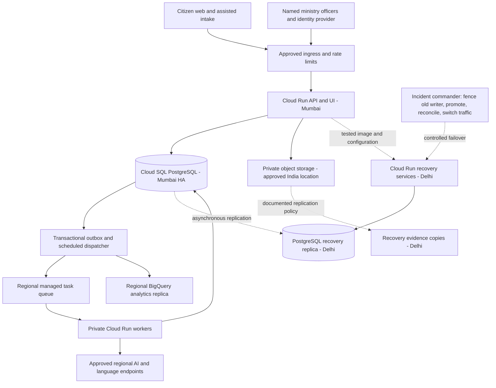

# NVB ministry pilot: deployment blueprint, roadmap and cost model

**Status: Implementation approved 19 September 2026; local pilot and deployment package prepared. Paid deployment and ministry opening pending.**

The user approved local implementation and preparation of the deployment package. This roadmap retains the proposed ministry operating plan; paid infrastructure, real citizen onboarding and ministry communications require separate authority. Current implementation evidence is in [the implementation report](MINISTRY_PILOT_IMPLEMENTATION_STATUS.md) and [deployment runbook](MINISTRY_PILOT_DEPLOYMENT_RUNBOOK.md). Prices are explicit planning assumptions, not verified current Google prices or supplier quotations. No ministry partnership is asserted.

## Decision proposed

Approved technical preparation supports a **six-week pilot, opening to a controlled cohort at the end of week 4**, for one programme under the Ministry of Jal Shakti and its participating state/district implementing bodies. Proposed initial geography: **Vellore, Tamil Nadu (lead district), and Tirupati, Andhra Pradesh (comparison district)**, subject to sponsor selection and participating authorities in both states. This recommendation reflects the project lead's location in Vellore and the practicality of visiting Tirupati while testing operation across a state boundary. Start with water-supply development requests in **Tamil, Telugu and English**. The second state is part of the proposed initial pilot, rather than a later expansion claim.

Use **Mumbai (`asia-south1`) as primary and Delhi (`asia-south2`) as recovery region**, with a single active PostgreSQL writer. Fund regional database high availability and an asynchronous Delhi replica for the live pilot. Configure and test recovery before accepting real reports. Regional service/SKU availability, capacity and processing-location terms must be confirmed during week 1.

Budget for **10,000 reports/month and 25 named officers**. The model gives approximately **₹1.23 lakh/month excluding tax**, including 25% contingency, or **₹1.46 lakh with an illustrative 18% tax**. A proposed ₹1.5 lakh monthly cloud envelope is provisional until quotes are checked. The six-week external-team example totals approximately **₹17.12 lakh before applicable taxes**, including build, training, review and cloud allowances; existing ministry/in-house staff can materially reduce cash procurement.

The four-week launch clock starts after a sponsor, implementing-agency consent, an approved cloud account, identity access and a usable data agreement are available. It is an engineering delivery target, not a promise to complete government procurement or approvals within four weeks. If prerequisites are delayed, week-4 output is an isolated synthetic/staff rehearsal rather than a live citizen pilot.

## Pre-implementation assessment (historical baseline)

The following table records the assessment before implementation. See the implementation report for completed work and actual verification. No live cloud account inspection is asserted.

| Area | Evidence now | Planned work before live intake |
|---|---|---|
| Application | Flask/Gunicorn container definition; Analyst and Auditor workflows; 201 local regression tests | Build and start the container in CI; pin and scan its image; add readiness/startup checks and rollback rehearsal |
| Operational data | SQLite is locally validated; PostgreSQL connection adapter exists | Fix and test PostgreSQL schema/migrations and all query paths, then use Cloud SQL PostgreSQL for multi-instance traffic |
| Concrete PostgreSQL issue | `POSTGRES_SCHEMA_SQL` in `visbharat/db.py` still contains SQLite `AUTOINCREMENT` syntax for `policy_decisions`; adapter normalization changes placeholders only | Correct dialect-specific DDL and insert-ID behavior; test fresh install, upgrade, concurrency, rollback and restore on PostgreSQL |
| Startup | Initializer creates schema and calls demo/user seeding | Make migrations a separately authorized deployment job; disable synthetic import and default role/user seeding in operational environments |
| Background processing | Queue records and Auditor evaluation results persist; evaluation execution uses a process-local thread executor | Move background work to authenticated queue-triggered workers; tasks must survive Cloud Run scale-to-zero, restart and regional recovery |
| Identity | Bearer roles and limited server-side state clearance; local demo role switching | Integrate the ministry identity provider; per-person identity, MFA policy, default-deny programme/district permissions and independent reviewers |
| Firebase | No Firebase/Firestore integration found in the inspected application, manifests or deployment documentation | Treat Firebase as optional future static hosting/identity integration; do not claim it is deployed |
| Analytics | BigQuery replica; operational Analyst/Auditor reads already avoid repeated cloud scans | Add a transactional outbox, bounded replay, reconciled analytics watermark, query budgets and clear replica freshness |
| AI and residency | Provider configuration exists; translation defaults to a `global` location | Inventory each selected model/speech/translation endpoint and its data-processing terms; disable unapproved geographic fallbacks |
| Evidence | 12,500 synthetic reports and readable source/evaluation disclosures | Start a separate operational database; verify programme-critical reference releases, boundary joins and agency investment records |
| Cloud capacity | Local benchmark: 100k reports/1m historical events; warm summary p95 80 ms, history p95 262 ms | Measure HTTP, PostgreSQL, cold starts, queue age, provider latency, failover and billing in the intended regions |

References: [Auditor implementation report](AUDITOR_IMPLEMENTATION_STATUS.md), [Auditor deployment/API](AUDITOR_DEPLOYMENT_AND_API.md), [Analyst deployment/API](ANALYST_DEPLOYMENT_AND_API.md), [database adapter](../visbharat/db.py), [container](../Dockerfile).

## MVP scope and the ministry's operating workflow

The sponsor should nominate one programme owner, a state nodal contact and data steward for each participating state, two district nodal officers, one independent audit lead and a security/operations owner. NVB must have a named place in an existing weekly review meeting; an additional dashboard without accountable owners will not fix fragmented demand handling. Department routing, scheme eligibility and permissions must be configured separately for Tamil Nadu and Andhra Pradesh; only authorised programme reviewers receive a combined view.

Start with **one urban ward and two rural panchayats in each district**, selected with the relevant implementing authorities. Vellore provides a nearby base for weekly observation and support; Tirupati tests whether the same workflow transfers to a Telugu-speaking cohort and an Andhra Pradesh administrative team. Compare service access, reliability, request handling and proposal evidence. These are evaluation questions, not assertions that either district has worse water services. The 10,000-report monthly figure is a capacity and cost scenario, not an expected recruitment count for these six communities.

Both pilot geographies require historical boundary checks: older Vellore records may cover its former undivided district, and pre-reorganisation records may not describe today's Tirupati district. Obtain validated village/ward-to-current-district crosswalks before using historical indicators. Do not substitute former-district averages for current pilot evidence. Official participation and source access remain prerequisites; living locally does not establish either.

| Include in the first live pilot | Acceptance example |
|---|---|
| Web text, browser-recorded voice and assisted intake | A citizen or authorised operator submits Tamil/Telugu/English input, receives a persistent ticket, and can correct the transcript or location |
| One existing district request export/import | An approved CSV or documented API imports source IDs with an idempotency key, programme mapping and processing basis; re-import does not duplicate a report |
| Human-reviewed classification and routing | Low-confidence, unusual-language and urgent reports reach the existing district review queue; AI unavailability does not lose an accepted submission |
| Source-linked proposal screening | Officers inspect demand clusters against verified local service coverage, deprivation/context and current programme commitments; unknown values remain visible |
| One comparable proposal set per district | Analyst prepares options and cost assumptions; engineer reviews; authorised officer records a decision; Auditor challenges the same project ID |
| Case management and rights | A finding can be assigned, investigated and closed by an independent reviewer; a purpose restriction affects subsequent processing and is reconciled downstream |
| Service follow-up | Collect a real baseline and a scheduled follow-up for selected works; keep citizen feedback, delivery completion and measured service change distinct |
| Portable accountability pack | Export redacted evidence, recorded decisions, source versions, costs and unresolved findings for a weekly ministry review |

Limit the first cohort to assisted/opt-in participation, with a published support route and approved notices. No mandatory citizen account or phone verification should be introduced merely to use Firebase; it adds friction and SMS cost. Rate-limited ticket access still needs a privacy-safe possession check.

WhatsApp is an optional second channel once the ministry's number, business verification, webhook contract and provider charges are approved. Browser voice and assisted intake allow launch without that dependency. Programme budget decisions remain human decisions; PFMS/treasury execution, automatic payment holds, procurement awards, nationwide rollout and causal impact certification are outside this MVP. Immediate hazards follow the ministry's existing response route and must not wait for capital-planning scores.

## Deployment blueprint

### Service and data placement

| Component | Pilot choice | Scale/recovery rule |
|---|---|---|
| API/UI | Cloud Run in Mumbai; start at 1 vCPU/1 GiB, one warm instance, concurrency 8, maximum 5 instances as a test configuration | Confirm memory and latency under load; identical immutable image staged in Delhi; cap instances and DB connections separately |
| Workers | Separate private Cloud Run service; regional managed queue with OIDC service identity; initial concurrency 4 and maximum 2 instances | Durable idempotent work keyed by report/event/model version; bounded retries and dead-letter state; compute only during dispatched work |
| Schedules | Managed scheduler invokes an authenticated outbox dispatcher; longer evaluations use bounded jobs | No background thread is relied upon after an HTTP response; replay incomplete work after restart |
| Operational database | Cloud SQL PostgreSQL, regional HA in Mumbai; initial planning size 2 vCPU/8 GiB, resized after tests | Delhi asynchronous cross-region replica; point-in-time recovery and backups independently tested; one writer at a time |
| Documents/audio | Private bucket with declared India location, short-lived signed access, checksums and approved retention | Recovery copies for evidence needed by a dossier; deletion/restriction manifest must follow copies and exports |
| Analytics | Mumbai BigQuery dataset, partitioned by appropriate event/intake dates and clustered for common programme/geography filters | Outbox replication, versioned updates/tombstones and daily parity checks; operational data is authoritative; rebuild analytics after recovery |
| Identity | Ministry IdP through a verified OIDC/SAML integration/gateway; workload service accounts through IAM | Programme and district claims enforced on APIs and exports; separate operator and audit identities |
| Secrets/configuration | Managed secrets; infrastructure identities, no downloadable service-account keys in containers | Approved secrets/keys available in recovery region; rotation and rollback recorded |
| Logs/evidence | Sanitised operational logs; restricted audit events; independent retained integrity checkpoints | Checkpoint custody separated from application operators; retention and deletion assessed separately for each record type |
| Environments | Separate development/staging and live projects, databases, identities and billing labels | Only synthetic/de-identified approved fixtures outside live; no shared live DB credentials for tests |

A useful initial DB connection budget is approximately `5 API instances × 8 request slots + 2 workers × 4 slots + 10 scheduled/admin slots = 58`, before deployment overlap and reserve. Set and test a hard aggregate pool budget with headroom against the chosen database limit. Cloud Run maximum-instance settings alone are not a hard database connection guarantee. Test old/new revision overlap during canary deployment.

Use one transactional outbox to record committed intake, analytics changes and downstream work. A database commit precedes a durable acknowledgment. Workers mark completion only after an idempotent database write. Queue replay may run a task twice; it must not create two tickets, bill an already completed model step again or duplicate a decision. Store provider invocation state/result hashes and reconcile ambiguous provider timeouts before replaying expensive work.

### Where Firebase fits

Firebase Hosting can be evaluated for public, non-sensitive static pages. The current Flask UI can remain on Cloud Run for the pilot, avoiding an unnecessary frontend migration. Authenticated dossiers, source documents, citizen text and receipts must not be publicly cached. Firebase Hosting's CDN distribution does not by itself establish India-only processing or recovery of an operational database.

If the ministry selects Firebase Authentication/Identity Platform, verify enterprise federation, pricing, metadata location and RBAC integration first. Do not create a second citizen/decision system of record in Firestore simply because it is serverless; that would add reconciliation work to a SQL-based application.

### Data residency and isolation

India-region API and database settings are only part of the location decision. The week-1 inventory must cover speech, translation, model inference, telemetry, identity, CDN/ingress, support access, backups and disaster recovery. A regional inference endpoint is usable only if the selected model and its processing terms meet ministry requirements. Do not silently fall back to a global endpoint.

Where approved language inference is unavailable, persist permitted raw intake with `processing_pending`, retain a human review route, and disclose the missing AI result. If the ministry requires a stricter jurisdictional boundary than the chosen public cloud services support, select an approved service stack before live use. Do not state that this blueprint certifies residency or government-cloud eligibility.

For this pilot, use one programme data boundary. For later unrelated ministries/agencies, use separate deployment/database cells or fully tested tenant enforcement; a client-supplied `tenant_id` is not an isolation control. Programme-specific geography clearance must be default-deny, including caches, files, background tasks and exports.

## Multi-region operation and recovery

| Failure | Proposed service behavior | Pilot acceptance target, not achieved result |
|---|---|---|
| One application instance | Route to a healthy instance; replay uncompleted work | No loss of committed tickets; p95 acknowledgment under 2 seconds under agreed normal load |
| One database zone | Regional HA failover; connections retry with bounded backoff | Recover the tested intake path within 5 minutes; verify committed ticket/event counts |
| AI/provider outage | Intake stays durable; classified result remains pending; approved manual review | No fabricated translation/classification; no unbounded retries or refresh-triggered model costs |
| BigQuery outage | Use operational views and show analytics watermark | No operational write loss; catch up after recovery and reconcile IDs/versions |
| Mumbai region loss | Incident commander fences the old writer and workers, promotes Delhi replica, switches connections/traffic and replays retained outbox | **RTO ≤60 minutes, RPO ≤15 minutes**, subject to a successful drill and measured replica lag; asynchronous replication does not guarantee zero loss |
| Backup/corruption recovery | Restore to an isolated instance, validate integrity and compare a declared watermark | Restore full pilot DB and referenced evidence within 4 hours in a drill; actual lost interval depends on chosen recovery point |

Replication is not a backup. A replica may reproduce a bad write. Test both regional promotion and independent restore.

Recovery sequence: detect and classify incident → inspect replica freshness → obtain incident command decision → fence old API/worker/database write authority → promote the selected replica → update secrets/connections and traffic → reconcile tickets, rights restrictions, outbox, files and audit head → replay pending tasks → announce recovery. Do not automatically send write traffic to a second region just because its HTTP health check passes. If fencing cannot be established, pause writes until single-writer safety is established.

The queue itself is not assumed to be replicated across regions. PostgreSQL outbox state is the replay source; unreplicated commits fall within the declared RPO exposure. If replica lag exceeds the RPO, disclose the recovery point and investigate the potentially missing ticket window before accepting a stronger recovery claim. Losing acknowledged reports is an incident, not successful failover.

Cloud SQL replica promotion does not recreate all HA, backup, monitoring and replication settings automatically. Document the post-promotion topology and restore those protections. Failback is a separate controlled migration with a new replica, reconciliation and rehearsal, not an immediate DNS reversal.

If the sponsor chooses a cheaper backup-only alternative, price it separately and accept a substantially weaker initial target, such as RPO 24 hours/RTO one business day until demonstrated otherwise. That alternative is not the recommended live pilot and must not use the warm-standby cost/SLO claim.

## Six-week implementation and pilot calendar

| When | Deliverables | Accountable role | Exit condition |
|---|---|---|---|
| Before day 1 | Sponsor charter; selected programme/districts; legal/data processing basis; approved cloud project/billing; identity contact; reference/data owners; named response route and participation from both states | Ministry sponsor and both state nodal contacts | These prerequisites are documented; otherwise cross-state launch date remains conditional |
| Week 1: foundations | Data inventory and minimum fields; region/model/SKU check; service and human baselines; verified reference shortlist; cost quote; IaC draft; PostgreSQL blocker fixes and container smoke test | Technical lead + data steward | Clean PostgreSQL install/upgrade passes; no demo seeding/default users in operational mode; architecture and cost assumptions reviewed |
| Week 2: integration | Named officer sign-in and permissions; intake adapter; immutable images; outbox, worker and analytics replay; assisted Tamil/Telugu/English flows; separate state routing; baseline and held-out evaluation collection | Backend, frontend/QA and district leads | Duplicate replay, cross-district and cross-state denial tests pass; synthetic rehearsal completes report → proposal → audit → export |
| Week 3: reliability and readiness | Mumbai HA/Delhi replica in staging; recovery and backup drills; load tests including cold scopes; provider-failure tests; 900 reviewed evaluation items; privacy/accessibility review; train officers in both states | SRE + QA + audit lead | No unresolved critical security/data-loss issue; tested recovery targets and quality results available; remaining limitations accepted or launch reduced |
| Week 4: controlled opening | Days 16–17 officer UAT and go/no-go; days 18–19 capped assisted cohort; day 20 expand only to approved pilot cohort | Sponsor + district nodal officers | Up to 200 real reports/day initially; assigned reviewers; daily quality/cost/parity review; no unapproved public campaign |
| Week 5: operating evidence | Increase toward 500/day after gates; weekly top-proposal review; citizen transcript/location corrections; multilingual error review; actual unit-cost report | Programme owner + data lead | Observed routing/queue SLOs, actual bill, source provenance and proposal feedback replace assumptions |
| Week 6: evaluation and decision | Compare handling effort with week-1 baseline; audit proposal reproducibility; recovery lessons; budget projection; ministry acceptance pack | Sponsor + independent audit lead | Expand to 20 districts, continue a corrective pilot, or pause; record reasons and unresolved evidence |

Maximum pilot intake is a capacity control, not a target to manufacture demand. Use the real cohort size as the denominator. Do not mix synthetic rehearsal counts with real adoption. Weeks 5–6 can demonstrate operational usefulness; most infrastructure service outcomes require follow-up at 30/60/90 days or after actual delivery.

The ministry's weekly review should inspect five to ten candidate problems, source quality, overlap with existing works, alternatives, engineering cost basis and unresolved audit cases. Its output is a recorded recommendation or decision with an accountable owner and next review date.

## Team, acceptance metrics and evidence

Plan for a backend lead (1 FTE), frontend/QA engineer (1 FTE), platform/SRE engineer (0.5 FTE), data/evaluation specialist (0.75 FTE), and delivery/policy lead (0.5 FTE). The sponsor, district officers, field reviewers and independent auditor also need scheduled time; a small software team cannot supply government authority or independently certify its own evidence.

| Gate | Proposed measure and denominator | Evidence needed |
|---|---|---|
| Durable intake | ≥99.5% successful durable acknowledgments among valid admitted submissions during the pilot window; report all outage minutes and excluded requests | Ingress/server metrics, durable ticket reconciliation, synthetic canaries and actual incident record; 99.5% over 30 days allows about 3.6 hours outage |
| Responsive UI | p95 acknowledgment ≤2 s; cached operational views ≤500 ms; first useful page ≤2 s on a declared 4G/device profile | Cloud HTTP tests across warm/cold traffic and 50 concurrent sessions; current local browser 1.7–2.6 s does not yet meet the target consistently |
| AI processing | 95% of admitted ≤60-second voice reports complete processing within 120 s under normal provider availability | Queue age, worker stage latency, retries and failures; asynchronous completion is separate from ticket acknowledgment |
| Language quality | Proposed macro-F1 ≥0.85 per pilot language; urgent-case recall ≥0.95 on a reviewed set; report confidence intervals and sample counts | 900 held-out items: 300 each in Tamil, Telugu and English, including ≥100 urgent examples/language; ≥100 voice items/language with noise/device coverage; double-reviewed labels and adjudication |
| Speech usability | Proposed WER ≤25% per language plus ≥90% correct extraction of service, urgency and location in reviewed voice samples | Human references; report CER as well, critical-entity errors, noisier groups and uncertainty; revise thresholds before launch if linguistically inappropriate |
| Actionable operations | ≥90% of sampled admitted reports routed to the correct accountable unit; ≥90% reviewed within 2 working days | Manual adjudication by district reviewers, timestamped queues, business calendar and unresolved share |
| Evidence quality | Every proposal has linked tickets, source versions and a reviewed cost basis, or a visible reason it is unready | Independent review of all pilot candidate packs; publisher/terms/crosswalk evidence for every indicator actually used |
| Rights/access | Zero successful unauthorized district/role access in the test matrix; restrictions reconciled across operational store, analytics, files and exports | Negative authorization tests, withdrawal/replay tests, downstream restriction manifest and steward review |
| Integrity/recovery | All protected pilot audit events verify; declared RPO/RTO met in drill; no duplicate committed tickets/decisions after replay | Captured audit head, separately retained checkpoint, restore/failover record and before/after reconciliation |
| Cost | Track ₹/admitted report, ₹/successfully processed report, ₹/voice minute and fixed monthly cost separately | Daily billing export plus provider usage; show failed/retried work and human review expense rather than excluding them |
| Ministry value | Candidate target: ≥30% reduction in median officer preparation time, compared with the documented manual baseline | Timed comparable review tasks; report number, complexity and selection bias; this is not proof of improved infrastructure outcomes |

Quality threshold misses trigger human review or a narrower language/channel launch. A high aggregate score must not conceal a weak Tamil, Telugu, English, noisy-audio or urgent-case subgroup. Actual citizen safety cases use the existing response process during evaluation. Two weeks of uptime data cannot substantiate an annual SLA. If only one state is ready, label the live scope accordingly and retain the other state's synthetic onboarding rehearsal; do not describe that as a completed live two-state pilot.

The week-6 pack contains the actual monthly cost projection, error and response-time distributions, district workflow results, reproducible proposal exports, data provenance, completed recovery drill, rights tests, open risks and the next 90-day measurement schedule.

## Transparent monthly cost model

The implementation uses Vertex for translation and classification. The original per-character translation allowance below is retained as a conservative reserve and must be replaced by measured tokens and the chosen model’s prices before procurement. No saving is claimed from this transport change.

Use [editable assumptions](planning/MINISTRY_COST_ASSUMPTIONS.json) and the [scenario spreadsheet CSV](planning/MINISTRY_COST_MODEL.csv). They use **₹90/USD**, **25% contingency**, no free-tier/credit assumptions and no negotiated discounts. FX, taxes, SKU availability, provider data-use terms and rates require a dated regional quote before a spending commitment.

The Vellore–Tirupati revision retains two districts and the same 10,000-report workload assumption, so it does not mechanically change these infrastructure calculations. Tamil/Telugu usage shares, provider charges, cross-state coordination, travel and the expanded 900-item language evaluation must be re-estimated before a budget commitment. The existing staffing total is a baseline allowance, not a confirmed quotation for the revised scope.

### Metered usage assumptions

Every report is modelled with 1,800 input and 350 output tokens. Thirty percent have one minute of voice; 70% require translation of 500 characters. A 1.10 usage multiplier covers some retries/extra processing. These are workload hypotheses to replace with measured telemetry, not product guarantees or a claim about the existing pipeline's actual token usage.

| Variable | Assumed unit rate | Calculation for 10,000 reports/month |
|---|---:|---:|
| Speech recognition | $0.024/minute | `10,000 × 0.30 × 1 × 1.10 = 3,300 minutes`; $79.20 |
| Translation | $20/million characters | `10,000 × 0.70 × 500 × 1.10 = 3.85m characters`; $77.00 |
| Model input | $0.50/million tokens | 19.8m input tokens; $9.90 |
| Model output | $3.00/million tokens | 3.85m output tokens; $11.55 |

These rates are modelling inputs for an unspecified approved model/service tier. They are not a current price quote for the configured demo model. If a residency-compatible model costs more, substitute its actual rates and token usage. Extra summarisation calls, audio reprocessing, embeddings or a second model pass require additional line items.

### Platform allowances in USD/month

| Cost line | 2-district pilot | 20-district expansion | Ministry planning scenario |
|---|---:|---:|---:|
| Primary Cloud SQL regional HA | 350 | 900 | 6,400 |
| Delhi asynchronous SQL replica(s) | 250 | 500 | 3,200 |
| Cloud Run API, workers and jobs | 70 | 300 | 2,000 |
| Load balancing, WAF and networking allowance | 45 | 80 | 300 |
| Private objects and backup storage | 35 | 120 | 500 |
| BigQuery storage and query allowance | 20 | 100 | 750 |
| Queue, secrets, artifacts and observability | 20 | 100 | 300 |
| Identity/static hosting allowance | 10 | 30 | 150 |
| Cross-region replication transfer | 20 | 60 | 300 |
| Separate non-production environment | 100 | 250 | 800 |
| **Platform subtotal** | **920** | **2,440** | **14,700** |

SQL, Cloud Run, networking and the other platform entries are capacity allowances to quote and benchmark, not a computed bill from validated machine SKUs. The pilot HA database plus recovery replica dominate the fixed bill. The ministry scenario assumes four isolated data cells, each with a primary/recovery pair; that topology has not been implemented or load-validated.

| Workload | Monthly reports / named officers | Platform + metered AI, before contingency | Monthly INR with 25% contingency, before tax | With illustrative 18% tax | Cloud ₹/report before tax |
|---|---|---:|---:|---:|---:|
| Two districts | 10,000 / 25 | $1,097.65 | **₹1.23 lakh** | ₹1.46 lakh | ₹12.35 |
| Twenty districts | 100,000 / 250 | $4,216.50 | **₹4.74 lakh** | ₹5.60 lakh | ₹4.74 |
| Ministry planning scenario: 100 districts | 1,000,000 / 2,000 | $32,465.00 | **₹36.52 lakh** | ₹43.10 lakh | ₹3.65 |

Formula: `monthly INR = (platform allowance + speech + translation + model) × 1.25 × FX`. This includes fixed infrastructure divided by the declared report volume; it is not the marginal cost of one new report. Unit cost rises if adoption is lower. The million-report scenario is a planning projection, not evidence of national-scale capacity.

As a sensitivity example, doubling average voice duration from one to two minutes adds approximately **₹8,910/month** at pilot volume, including contingency before tax, and **₹8.91 lakh/month** at one million reports. Doubling model token rates adds about **₹2,413/month** at pilot volume. Change FX by 10% and the USD-denominated total changes by 10%. Replace allowances when actual database, network and support quotes arrive.

Excluded unless separately commissioned: WhatsApp/BSP and SMS/telephony fees, paid Maps usage, private circuits, premium support, enterprise SSO licence uplift, specialised compliance assessment, engineering and government staff time. Applicable taxes vary by contract; 18% is only an illustrative cash-planning calculation.

### Six-week mobilisation and ongoing people cost

The following is an external-team procurement example using 1.5 months for six weeks, not a quotation. Ministry officers' authority and review time remain an in-kind commitment unless separately contracted.

| Resource | Assumption | Six-week allowance |
|---|---|---:|
| Backend lead | 1 FTE × ₹2.40 lakh/month × 1.5 | ₹3.60 lakh |
| Frontend/QA engineer | 1 FTE × ₹1.80 lakh/month × 1.5 | ₹2.70 lakh |
| Platform/SRE | 0.5 FTE × ₹2.60 lakh/month × 1.5 | ₹1.95 lakh |
| Data/evaluation specialist | 0.75 FTE × ₹1.80 lakh/month × 1.5 | ₹2.025 lakh |
| Delivery/policy lead | 0.5 FTE × ₹2 lakh/month × 1.5 | ₹1.50 lakh |
| Independent security/privacy review | Fixed allowance | ₹0.75 lakh |
| Field training/travel | Fixed allowance | ₹0.75 lakh |
| **People and mobilisation subtotal** | | **₹13.275 lakh** |
| People contingency | 15% | ₹1.991 lakh |
| Six weeks of pilot cloud | 1.5 × ₹1.234856 lakh; already includes cloud contingency | ₹1.852 lakh |
| **Proposed six-week total before applicable taxes** | | **₹17.12 lakh** |

Once built, an example monthly operations allowance is 0.25 SRE FTE (₹65,000) plus 100 hours of review/support at ₹600/hour (₹60,000), **₹1.25 lakh/month**, in addition to cloud. That puts the example ongoing total at roughly **₹2.48 lakh/month before taxes**. One hundred review hours would cover 2,000 three-minute reviews; it does not cover manual review of every request or detailed engineering surveys. If more human review is necessary, increase this budget instead of lowering quality gates. The initial build budget already includes its evaluation staff, so this ongoing allowance is not added again to the six-week total.

## Cost optimisation with accountable controls

| Priority | Proposed control | Check that makes the saving credible |
|---|---|---|
| P0 | Keep ordinary operational dashboards model-free; perform classification/translation once per input/model version | Provider calls per report and per dashboard view; target zero model calls on ordinary views |
| P0 | Persist idempotency and step results; bounded retries with circuit breakers | Retry spend, duplicate-job rate and completed-result reuse; provider outages cannot create retry storms |
| P0 | Cap model output/context; combine compatible extraction tasks; use a smaller approved model when it passes language/urgency gates | Compare cost and per-language error on the same held-out set before changing the production model |
| P0 | Bound Cloud Run instances/concurrency and database pools; keep live API warm but allow workers/non-production to idle | CPU/memory, request queueing, connection saturation, cold-start latency and actual idle charges |
| P0 | Operational SQL for officer views; partition/cluster BigQuery and apply required partition filters, maximum billed bytes, custom query quotas and deadlines | Daily bytes processed, failed budget-limited queries and cost per dashboard session; budget ceilings are configuration, not UI suggestions |
| P1 | Batch analytics replication and reports where freshness permits; show last successful watermark | Target ≤15-minute analytics lag under normal operation; privacy restrictions propagate with higher priority |
| P1 | Resize database from measured CPU, working set, IOPS, connections and failover load | Retain headroom for recovery; do not eliminate live HA to create an attractive headline price |
| P1 | Minimise repeated translation, unnecessary audio retention and large attachments; lifecycle objects under approved retention rules | Bytes/voice minute, translation reuse within authorised scope, restore tests and deletion/restriction evidence |
| P1 | Limit verbose application logs and sample routine telemetry while retaining required audit evidence | Separate operational-log cost from mandatory audit retention; redact citizen data from diagnostics |
| P1 | Prefer existing ministry identities; make SMS/WhatsApp optional contracted channels | Actual per-channel adoption and vendor invoice; preserve assisted and voice access for excluded groups |
| P2 | Consider committed-use discounts only after stable measured demand and verified discount eligibility | Baseline utilisation, break-even term and exit cost; no multi-year commitment in the pilot estimate |

Create budget alerts at 50%, 80% and 100% of the approved monthly envelope with forecast alerts and named recipients. **Cloud budget alerts are not hard spending caps.** Combine them with service quotas, maximum instances, BigQuery query limits and application token/audio/job budgets. At the threshold, defer discretionary summaries/evaluations, flag manual processing and notify the owner; preserve authorized raw intake and do not silently discard a citizen report.

Bill by environment, programme, service and region. Usage records should capture tokens, voice minutes, translated characters, retry count, queue age, data scanned and provider/model version without storing citizen content in billing logs. Review the forecast daily during opening, weekly afterward. Set one explicit owner for approving capacity increases.

## Expansion after the pilot

| Stage | Entry gate | Deployment change |
|---|---|---|
| 2 → 20 districts, approximately weeks 7–12 | Sponsor accepts week-6 evidence; stable real unit cost, language results, source licences and recovery drill | Add districts in batches of five, validate state-specific routing/clearance and local references, and add further languages when reviewers and hold-out labels are available; resize from measured peaks |
| Programme/state federation | Separate participating authorities sign data contracts and designate controllers/stewards | Versioned schemas, stable official geography joins, explicit programme authority and export restrictions; separate data cells where needed |
| Ministry-level operation | Independent security/accessibility review, sustained SLOs, real cost forecast and operational staffing | Load-test each cell, regional recovery and fleet coordination; publish only disclosure-reviewed aggregate accountability data |

Do not stretch the current `NVB-YYYYMMDDXXXX` display format into a national unique-ID guarantee. Four hexadecimal characters allow only **65,536 suffixes per day** before considering collision retries. Before high-volume/multi-cell expansion, adopt a globally unique internal ID and an approved longer or namespaced public ticket format, with aliases for existing tickets and a documented migration. Test duplicate imports across cells and programme boundaries.

Audit-chain writes currently serialize through a shared head. Benchmark contention on PostgreSQL, including concurrent case, receipt and intake writes, before increasing replicas. If using independent agency cells, keep each protected stream independently verifiable and record cross-cell references/checkpoints; do not claim a single global transaction chain without implementing one.

## Principal launch risks and decision owners

| Risk/dependency | Owner | Required response |
|---|---|---|
| Procurement, IdP or data agreement not available | Sponsor | Shift live opening; continue synthetic/staff rehearsal only |
| PostgreSQL/container migration fails | Technical lead | Complete dialect/transaction fixes and clean-install/restore proof before live data |
| Reference sources lack provenance or correct geography | Data steward | Verify the minimum source set or omit the indicator and show the gap; do not upgrade a label by assertion |
| Regional AI/service availability conflicts with ministry requirements | Architecture/security owner | Select an approved service or manual-processing path; reprice before live use |
| Voice/urgency subgroup underperforms | Evaluation lead and district owner | Add human review or narrow rollout; retain results and uncertainty |
| Recovery cannot meet measured RPO/RTO | SRE and sponsor | Fix replication/runbooks or approve an explicitly reduced operating scope; no multi-region-success claim |
| Staff cannot service queues | District nodal officers | Reduce admitted cohort, assign reviewers and publish expected response time |
| Quote or usage exceeds the proposed envelope | Budget owner | Revise model/volume or seek a documented increase before provisioning beyond the approved limit |

## Approved implementation packages and external launch gates

**The user approved this scope and implementation plan.** Cloud prices remain unverified; no signed ministry commitment or permission to send messages on the ministry's behalf is asserted. Packages 04–06 retain external evidence and operational activities that software implementation cannot certify.

After approval, prepare these reviewable packages in order:

1. **PILOT-01: foundations** — clean PostgreSQL migrations, operational bootstrap controls, container CI and environment separation.
2. **PILOT-02: access and ingestion** — ministry identity adapter, district/role authorization, approved import contract and durable asynchronous intake.
3. **PILOT-03: deployment and recovery** — infrastructure-as-code, service identities, Mumbai/Delhi topology, budgets/quotas, backup and failover runbooks. Produce a priced infrastructure plan before any paid resource is applied.
4. **PILOT-04: quality and operating model** — reference verification checklist, reviewed language/audio set, district training and named queue ownership.
5. **PILOT-05: acceptance** — cloud load/restore/replay tests, cost dashboard, independent review findings and a release candidate.
6. **PILOT-06: controlled launch** — sponsor go/no-go, limited intake, daily measurements, week-6 decision pack and 90-day follow-up schedule.

Proposed defaults for approval: Vellore in Tamil Nadu and Tirupati in Andhra Pradesh, initially one urban ward and two rural panchayats per district, water supply, Tamil/Telugu/English, capacity planning at 10,000 reports/month, 25 officers, four-week controlled opening and six-week evaluation subject to readiness in both states, Mumbai primary/Delhi recovery, and a provisional ₹1.5 lakh/month cloud cash envelope including illustrative tax. Ministry choice, procurement route, language evaluation and staffing may change these assumptions before execution. Record approval and changes; do not interpret silence as approval.

## Suggested jury wording

“NVB has a six-week ministry adoption plan: a controlled two-district launch by week four, subject to sponsor and data readiness, followed by measured operating evidence. The proposed India deployment uses a Mumbai primary and a prepared Delhi recovery path whose drill remains a launch gate. At 10,000 reports per month, the transparent planning model is approximately ₹1.23 lakh per month before tax, including standby capacity and contingency. Decisions remain reviewable, sources retain their verification status, and scale-up depends on measured quality, recovery and actual cost.”

Replace older pitch statements such as “pilot-proven” with the demonstrated facts: the existing corpus and local pilot are synthetic; real ministry participation and operational results remain unverified. A jury should see a costed, testable route to adoption rather than infer an existing government deployment.

## Official references to validate before procurement

These are reference URLs for verification, not pages fetched or current prices certified during this planning task.

- [Google Cloud pricing calculator](https://cloud.google.com/products/calculator)
- [Cloud Run pricing](https://cloud.google.com/run/pricing) and [deployment locations](https://cloud.google.com/run/docs/locations)
- [Cloud SQL pricing](https://cloud.google.com/sql/pricing), [PostgreSQL HA](https://cloud.google.com/sql/docs/postgres/high-availability) and [replication](https://cloud.google.com/sql/docs/postgres/replication)
- [Cloud Tasks locations](https://cloud.google.com/tasks/docs/locations)
- [Vertex AI generative pricing](https://cloud.google.com/vertex-ai/generative-ai/pricing) and [model locations](https://cloud.google.com/vertex-ai/generative-ai/docs/learn/locations)
- [Speech pricing](https://cloud.google.com/speech-to-text/pricing) and [Translation pricing](https://cloud.google.com/translate/pricing)
- [BigQuery pricing](https://cloud.google.com/bigquery/pricing) and [dataset locations](https://cloud.google.com/bigquery/docs/locations)
- [Firebase pricing](https://firebase.google.com/pricing) and [Firebase project locations](https://firebase.google.com/docs/projects/locations)
- [Cloud budget behavior](https://cloud.google.com/billing/docs/how-to/budgets)

Have the deployment owner retain a dated calculator export with exact regions, edition/SKUs, HA and replica counts, minimum-instance hours, networking, support, identity licensing, currency and taxes. That becomes the spending baseline; this draft does not.
